# **LABORATORIO SIMULACIÓN SPICE** ### *(Powered by José Herce. Inspired
by the work of Dr. Alberto Corbi)*

## Objetivo del laboratorio El objetivo de la presenta práctica es
conocer el estándar de simulación de circuitos
`SPICE <http://bwrcs.eecs.berkeley.edu/Classes/IcBook/SPICE>`__ y
realizar pequeñas simulaciones en corriente continua con el mismo. SPICE
es una forma elegante y sencilla de codificar circuitos eléctricos de
manera que puedan ser procesados por un ordenador. Mediante un sencillo
lenguaje podemos definir resistencias, fuentes de alimentación, etc.,
las conexiones entre ellos y los resultados que deseamos obtener.

## El estándar SPICE **SPICE** es una abreviación de *Simulation Program
with Integrated Circtuit Emphasis*. Se trata básicamente de un método
estándar para describir circuitos usando texto plano en lugar de una
representación gráfica (o *esquemática*). A esta descripción en texto se
la llama también **netlist** y básicamente se corresponde con la *lista*
de los componentes del circuito y cómo estos están conectados entre sí,
es decir, de los nodos de unión. Los ficheros netlist pueden tener
extensiones ``.cir``, ``.net``, ``.ckt``, ó ``.sp`` y es muy común
encontrárselos con cualquiera de estas.

Existen en el mercado muchas variantes (intérpretes) de Spice, aunque el
original fue descrito en la Universidad de Berkeley. En la lista de
intérpretes de Spice tenemos desde esfuerzos y proyectos comerciales
hasta *open source* y regidos por distintas comunidades de usuarios y
programadores.

   **Pregunta:**

**Enumera todos los intérprete de Spice que puedas encontrar. Crea una
tabla en Markdown con varias columnas (para el nombre, fabricante,
versión actual, licencia y alguna característica sobresaliente). Aquí
tienes un ejemplo del que puedes partir y seguir completando:**

+----------------+----------------+----------------+----------------+
| Intérprete     | Licencia       | Fabricante     | C              |
|                |                |                | aracterísticas |
+================+================+================+================+
| Ahkab          | GPL            | Giuseppe       | Basado en      |
|                |                | Venturini      | Python         |
+----------------+----------------+----------------+----------------+
| LTspice        | Gratuito       | Linear         |                |
|                |                | Technology,    |                |
|                |                | Analog Devices |                |
+----------------+----------------+----------------+----------------+
| PSpice         | Propietaria    | Cadence Design |                |
|                |                | Systems        |                |
+----------------+----------------+----------------+----------------+
| Orcad          | Propietaria    | Cadence Design |                |
|                |                | Systems        |                |
+----------------+----------------+----------------+----------------+
| NG-spice       | Licencia BSD   | Comunidad      |                |
|                |                | Software libre |                |
+----------------+----------------+----------------+----------------+
| macspice       | Licencia BSD   | Charles D. H.  |                |
|                |                | Williams       |                |
+----------------+----------------+----------------+----------------+
| SPICE          | Licencia BSD   | Donald         | Es el estándar |
|                |                | Pederson y     |                |
|                |                | Larry Nagel.   |                |
+----------------+----------------+----------------+----------------+
| Multisim       | Proprietary    | National       |                |
|                | EULA           | Instruments    |                |
+----------------+----------------+----------------+----------------+
| Oregano        | GNU General    | Richard Hult   |                |
|                | Public License |                |                |
+----------------+----------------+----------------+----------------+
| Proteus Design | Privada        | Labcenter      |                |
| Suite          |                | Electronics    |                |
|                |                | Ltd.           |                |
+----------------+----------------+----------------+----------------+
| Intusoft       | Privada        | Intusoft       |                |
+----------------+----------------+----------------+----------------+
| SIMetrix Intro | Privada        | SIMetrix       |                |
|                |                | Technologies   |                |
|                |                | Ltd            |                |
+----------------+----------------+----------------+----------------+
| TopSPICE       | Privada        | Penzar         |                |
|                |                | Development    |                |
+----------------+----------------+----------------+----------------+
| Spice Opus     | Privada        | EDA Group,     |                |
|                |                | Faculty of     |                |
|                |                | Electrical     |                |
|                |                | Engineering    |                |
+----------------+----------------+----------------+----------------+
| Mentor         | Privada        | Siemens        |                |
| Graphics       |                |                |                |
+----------------+----------------+----------------+----------------+
| Tina Pro       | Privada        | DesignSoft,    |                |
|                |                | Inc.           |                |
+----------------+----------------+----------------+----------------+
| Altium         | Privada        | Altium         |                |
| Designer       |                |                |                |
+----------------+----------------+----------------+----------------+
| Qucs           | GNU GPL v2+    | Michael        |                |
|                |                | Margraf,       |                |
|                |                | Stefan Jahn et |                |
|                |                | al.            |                |
+----------------+----------------+----------------+----------------+
| ASCO tool      | Libre          | Comunidad      |                |
|                |                | ascodev        |                |
+----------------+----------------+----------------+----------------+
| gEDA           | GNU General    | Ales Hvezda et |                |
|                | Public License | al.            |                |
+----------------+----------------+----------------+----------------+
| Gnucap         | GNU            | Albert Davis   |                |
+----------------+----------------+----------------+----------------+
| TclSpice       | BSD license    | adrian_dawe,   |                |
|                |                | saintel,       |                |
|                |                | stefanjones    |                |
+----------------+----------------+----------------+----------------+

   **Pregunta:**

**¿Qué comparación puedes efectuar entre C y Spice como estándares
(lenguajes) y sus respectivas implementaciones en software? ¿Qué
implementaciones reales (compiladores) del lenguaje C conoces?**

   **Respuesta:**

C es un lenguaje de programación estructurada de propósito general.
Spice no es un lenguaje de programación de propósito general, sino un
lenguajes de dominio específico cuyo objetivo es simular circuitos
electrónicos. De hecho la última versión, SPICE 3 está desarrollada en
C, aunque sus predecesoras se desarrollaron en FORTRAN.

## Elementos de un netlist Como acabamos de comentar, un netlist se
corresponde con la codificación de los elementos electrónicos de un
circuito y las uniones entre los mismos. Veamos con más concreción qué
partes y secciones lo componen.

## Comentarios

La primera línea de un netlist se corresponderá siempre con un
comentario. A partir de esta línea se pueden introducir más comentarios
pero tienen que ir siempre precedidos de un ``*``. Ejemplo:

.. code:: spice

   Mi primer circuito
   * Otro comentario
   * más comentarios
   *

## Dispositivos básicos de un circuito Los elementos de un netlist son
los mismos que encontramos en cualquier circuito eléctrico sencillo,
tales como resistencias, **condensadores**, **bobinas**,
**interruptores**, **hilos** y **fuentes** de alimentación. Para
distinguir uno de otro, se reserva una letra característica: ``V`` para
fuentes de alimentación, ``R`` para resistencias, ``C`` para
condensadores y ``L`` para bobinas. También es posible usar estas letras
en su versión en minúscula (``r``, ``v``, ``c``, ``l``, etc.). Después
de esta letra característica se puede sufijar cualquier texto para
diferenciar un elemento de otro (números, letras, palabras, etc.).
Ejemplo:

::

   * Una resistencia
   R1
   *  Otra resistencia
   R2
   * Fuente de alimentación
   V
   * Un condensador
   Cprincipal

## Conexiones A continuación de indicar el elemento eléctrico, tenemos
que informar a Spice cuáles son los puntos de unión tanto a un lado como
al otro del elemento. Así es como Spice sabe qué está conectado a qué:
porque comparten un **punto** (o **nodo**, aunque este término se
reserva sobre todo a uniones de más de dos elementos) que hemos
señalizado correctamente. Para nombrar nodos, lo mejor es emplear una
numeración secuencial: 0…n. **La enumeración de los puntos de unión es
completamente a nuestro criterio**.

::

   * Una resistencia
   * entre cables 0 y 1
   R1 0 1

**Sólo es necesario seguir un criterio**: en el caso de una fuente de
alimentación, el nodo que pondremos primero será aquel que está más
cerca del *borne* positivo. Ejemplo:

.. code:: spice

   * Para una fuente indicamos primeramente conexión a nodo positivo.
   v 2 3 type=vdc vdc=1

En el *caso de LTspice* no es necesario indicar los parámetros
``type=vdc`` y ``vdc=X``, sino que si no se especifica nada, se supone
que el último valor es el del voltaje a corriente continua:

.. code:: spice

   * Especificación de una fuente de alimentación de 10 V en corriente continua en el caso de LTspice
   v 0 1 10

Aquí tienes un ejemplo gráfico de los componentes comentados justo
arriba (resistencia y voltaje):

|image1|

## Unidades en SPICE

Las unidades de las magnitudes características del circuito son siempre
`unidades del Sistema
Internacional <https://en.wikipedia.org/wiki/SI_electromagnetism_units>`__
y no es necesario indicarlo explícitamente en el netlist.

La forma de especificar múltiplos de estas cantidades es añadiendo una
letra. Básicamente las que nos interesan y las que suelen aparecer
mayoritariamente son ``k`` para “kilo-,” ``m`` para “mili?” y ``u`` para
“micro?”.

.. |image1| image:: https://raw.githubusercontent.com/pammacdotnet/spicelab/master/resistencia%20y%20pila%20con%20nodos.svg?sanitize=true

   **Pregunta:**

**Crea una tabla en Markdown con todos los prefijos de múltiplos que
puedas, su abreviatura y su equivalencia numérica.**

   **Respuesta:**

======= =============== ======= ======= ================ =======
Prefijo Valor           Simbolo  Prefijo Valor            Simbolo
======= =============== ======= ======= ================ =======
yotta   :math:`10^{24}` Y        deci    :math:`10^{-1}`  d
zetta   :math:`10^{21}` Z        centi   :math:`10^{-2}`  c
exa     :math:`10^{18}` E        mili    :math:`10^{-3}`  m
peta    :math:`10^{15}` P        micro   :math:`10^{-6}`  µ
tera    :math:`10^{12}` T        nano    :math:`10^{-9}`  n
giga    :math:`10^{9}`  G        pico    :math:`10^{-12}` p
mega    :math:`10^{6}`  M        femto   :math:`10^{-15}` f
kilo    :math:`10^{3}`  k        atto    :math:`10^{-18}` a
hecto   :math:`10^{2}`  h        zepto   :math:`10^{-21}` z
deca    :math:`10^{1}`  da       yocto   :math:`10^{-24}` y
======= =============== ======= ======= ================ =======

En el caso de las fuentes de alimentación hemos de especificar si se
trata de corriente continua (``vdc``) o alterna (``ac``).

::

   * Una resistencia de 5 Ohmios
   R2 1 0 5
   * Una pila de 10 Voltios (continua)
   V1 1 0 type=vdc vdc=10
   * Una resistencia de 5 kΩ
   RX 2 4 5k

   **Pregunta**:

¿qué unidades del Sistema Internacional relacionadas con la asignatura
–y los circuitos en general– conoces? Responde aquí mismo en una celda
de Markdown con una tabla.

   **Respuesta**:

============================= =======================
Unidad                        Magnitud
============================= =======================
Voltio (:math:`\mathrm{V}`)   Diferencia de potencial
Amperio (:math:`\mathrm{A}`)  Intensidad
Ohmio (:math:`\Omega`)        Resistencia eléctrica
vatio (:math:`\mathrm{W}`)    Potencia eléctrica
Culombio (:math:`\mathrm{C}`) Carga eléctrica
faradios (:math:`\mathrm{F}`) Capacidad de carga
Henrio (:math:`\mathrm{H}`)   Inductancia
Hercio (:math:`\mathrm{Hz}`)  Frecuencia
Siemens (:math:`\mathrm{S}`)  Conductividad eléctrica
============================= =======================

## Valores iniciales

Aparecen justo al final de la definición del componente (``ic``). Suelen
aplicarse principalmente con condensadores.

::

   * Una condensador inicialmente no cargado
   c 1 0 1u ic=0

## Fin del circuito

El fin de la descripción de un netlist se especifica mediante el comando
``.end``.

.. code:: spice

   * Mi primer circuito
   V 1 0 vdc=10 type=vdc
   R 1 0 5
   * Fin del circuito
   .end

## Comandos SPICE para circuitos en corriente continua

Además de la descripción del circuito, hemos de indicar al intérprete de
Spice qué tipo de análisis queremos realizar en sobre el mismo y cómo
queremos presentar la salida de la simulación. Los comandos en Spice
empiezan por un ``.`` y suelen escribirse justo al final del circuito,
pero antes del comando ``.end``.

::

    Mi primer circuito
   * Aquí van los componentes
   R 1 0 6k
   ...
   * Comandos
   .op
   ...
   * Fin del circuito
   .end

   **Pregunta**:

Hasta lo que has visto del lenguaje Spice, ¿dentro de qué tipo o
conjunto de lenguajes encajaría? ¿Funcionales? ¿Específicos de dominio?
¿Procedurales? ¿Estructurados? ¿Orientado a Objetos ¿Funcionales?
Justifica tu respuesta.

   **Respuesta**:

Vaya, creo que ya he respondido a esta pregunta. Es un lenguaje
especifico de dominio, diseñado para usarse en un dominio de aplicación
muy acotado, la simulación de circuitos eléctricos y electrónicos. No es
un lenguaje de propósito general.

Veamos los principales comandos de simulación:

-  ``.op`` es el comando más sencillo que podemos emplear en. Devuelve
   el voltaje e intensidad en cada ramal y componente del circuito. Este
   comando no necesita parámetros.
-  ``.dc`` es uy parecido al comando ``.op`` pero nos permite cambiar el
   valor del voltaje de una fuente de alimentación en pasos consecutivos
   entre el valor A y el valor B. En el caso de que la fuente tuviera
   asignada ya un valor para su voltaje, este sería ignorado. Ejemplo:

.. code:: spice

   * Variamos el valor del voltaje
   * de la fuente "v" de 1 a 1000
   * en pasos de 5 voltios
   v 1 0 type=vdc vdc=10
   .dc v 1 start=1 stop=1000 step=20
   v2a 2 4 type=vdc vdc=9
   * Igual para v2a. Se ignora su voltaje de 9V
   .dc v2a start=0 stop=10 step=2

-  El comando ``.tran`` realiza un análisis en el tiempo de los
   parámetros del circuito. Si no se emplea la directiva ``uic`` (*use
   initial conditions*) o esta es igual a cero, este análisis se realiza
   desde el punto estable de funcionamiento del circuito hasta un tiempo
   ``tfinal``. y en intervalos ``tstep``. Si empleamos un valor distinto
   para parámetro ``uic``, entonces se hará uso de las condiciones
   iniciales definidas para cada componente (típicamente ``ic=X`` en el
   caso de los condensadores, que da cuenta de la carga inicial que
   estos pudieran tener).

::

   * Hacemos avanzar el tiempo entre
   * tinicial y tfinal en pasos tstep
   .tran tstart=X tstop=Y tstep=Z uic=0/1/2/3

``X``, ``Y`` y ``Z`` tienen, evidentemente unidades de tiempo en el S.I.
(segundos).

   **Pregunta**:

El parámetro ``uic`` puede tener varios valores y cada uno significa una
cosa. Detállalo usando un celda Markdown y consultando la `documentación
de
Ahkab <https://buildmedia.readthedocs.org/media/pdf/ahkab/latest/ahkab.pdf>`__.

   **Respuesta**:

-  uic=0: Hace que se entiendan como 0 todos los voltajes y corrientes
   de los nodos conectados a ``v``/``h``/``e``/``source`` en el instante
   ``t=tstart``.
-  uic=1: el análisis OP mostrará el estado en el instante t=tstart como
   ultimo resultado.
-  uic=2: el estado en ``t=tstart`` es el último resultado de un
   análisis OP en el que se establecen los valores de las corrientes a
   través de inductores y tensiones en los condensadores especificados
   en su ``ic``. Esto se hace de manera muy aproximada, se recomienda
   verificar.
-  uic=3: carga el valor ``ic`` proporcionado por el usuario. Esto
   requiere una directiva ``.ic`` en algún lugar de la lista de
   conexiones y el nombre de ``.ic`` y de ``ic_label`` deben coincidir.

## Intérprete SPICE que vamos a usar: Ahkab Tras un estándar siempre hay
una o varias implementaciones. Ahkab no deja de ser una implementación
más en Python del estándar Spice.

   **Pregunta:**

Comenta las distintas implementaciones de lenguajes y estándares que
conozcas. Hazlo usando una tabla en Markdown.
`Aquí <https://www.markdownguide.org/extended-syntax/#tables>`__ tienes
un poco de ayuda (aunque antes ya se ha puesto el ejemplo de una tabla).

   **Respuesta:**

=========== ========== ========== ========== ===============
PHP         Python     Javascript Java       Otros
=========== ========== ========== ========== ===============
Laravel     Django     Express.js Spring     Ruby - Sinatra
CodeIgniter Pyramid    React.js   Dropwizard C# - ReactiveUI
Symfony     Web2py     Angular.js GWT        
CakePHP     CubicWeb   Node.js    JSF        
Yii         Dash       Deno.Js    Struts     
Codeigniter CherryPy   Polymer.Js            
\           Tornado    Ember.Js              
\           SymPy                            
\           Matplotlib                       
\           SciPy                            
\           TensorFlow                       
=========== ========== ========== ========== ===============

   **Pregunta:**

Describe brevemente este software (creador, objetivos, versiones,
licencia, características principales, dependencias, etc.).

   **Respuesta:**

SPICE es un lenguaje de dominio específico desarrollado por la
Universidad Berkeley en California en 1973 por Donald O. Pederson y
Laurence W. Nagel.

Su nombre viene del acrónimo inglés de Simulation Program with
Integrated Circuits Emphasis (Programa de simulación con énfasis en
circuitos integrados). Es un estándar internacional cuyo objetivo es
simular circuitos electrónicos analógicos compuestos por resistencias,
condensadores, diodos, transistores, etc. Para ello hay que describir
los componentes, describir el circuito y luego elegir el tipo de
simulación (temporal, en frecuencia, en continua, paramétrico,
Montecarlo, etc.).

Esta desarrollado bajo licencia BSD. Las primeras versiones fueron
desarrolladas en FORTRAN hasta la tercera y actual versión que se
desarrolló en C. Actualmente el proyecto continua en desarrollo.

# Trabajo práctico Muy bien, ahora toca definir circuitos y ejecutar
simulaciones sobre los mismos gracias a Ahkab. ## Instalación de
bibliotecas necesarias Si estás utilizando Anaconda, asegúrate de tener
su entorno activado:

.. code:: cmd

   C:\> conda activate base (en el caso de Windows)

ó

.. code:: bash

   $ source /usr/local/Caskroom/miniconda/base/bin/activate (en el caso de macOS)

En el caso de Windows tienes que tener en el PATH el directorio donde se
encuentre el comando ``conda`` (visita la sección de `Environment
Variables <https://superuser.com/questions/949560/how-do-i-set-system-environment-variables-in-windows-10>`__
del `Panel de
Control <https://www.digitalcitizen.life/8-ways-start-control-panel-windows-10>`__).
Si has instalado Anaconda con `está
opción <https://docs.anaconda.com/_images/win-install-options.png>`__
marcada, ya no tienes que preocuparte por ello.

En el caso de usar Visual Studio Code, este puede encontrar
automáticamente la distintas distribuciones de Python que tengamos
instaladas y si abrimos un terminal, este se adaptará automáticamente al
entorno Python que hayamos seleccionado. La configuración de Python en
VS Code está bien explicada su
`documentación <https://code.visualstudio.com/docs/python/python-tutorial>`__.

|image1|

Ahora ya puedes instalar Ahkab:

::

   (base) $ pip install ahkab

.. |image1| image:: https://raw.githubusercontent.com/microsoft/vscode-python/main/images/InterpreterSelectionZoom.gif

También puedes instalar Ahkab directamente desde este mismo notebook:

.. code:: ipython3

    get_ipython().system('pip install ahkab')


.. parsed-literal::

    Requirement already satisfied: ahkab in c:\users\joseh\scoop\apps\miniconda3\current\lib\site-packages (0.18)
    Requirement already satisfied: tabulate>=0.7.3 in c:\users\joseh\scoop\apps\miniconda3\current\lib\site-packages (from ahkab) (0.8.7)
    Requirement already satisfied: scipy>=0.14.0 in c:\users\joseh\scoop\apps\miniconda3\current\lib\site-packages (from ahkab) (1.5.4)
    Requirement already satisfied: sympy>=0.7.6 in c:\users\joseh\scoop\apps\miniconda3\current\lib\site-packages (from ahkab) (1.6.2)
    Requirement already satisfied: numpy>1.7.0 in c:\users\joseh\scoop\apps\miniconda3\current\lib\site-packages (from ahkab) (1.19.1)
    Requirement already satisfied: mpmath>=0.19 in c:\users\joseh\scoop\apps\miniconda3\current\lib\site-packages (from sympy>=0.7.6->ahkab) (1.1.0)
    

Como siempre, una vez instalado cualquier framework para Python, ya lo
podemos utilizar, tanto desde el
`REPL <https://en.wikipedia.org/wiki/Read–eval–print_loop>`__ como desde
un entorno Jupyter (Jupyter,
`Jupyterlab <http://jupyterlab.readthedocs.io/en/stable/>`__, VS Code o
nteract). Recuerda que para usar el kernel Python (que viene con
Anaconda) desde nteract debes seguir las instrucciones que se indican en
su `documentación oficial <https://nteract.io/kernels>`__.

Como vamos a pintar algunas gráficas, necesitamos instalar
`matplotlib <https://matplotlib.org>`__. Al igual que con Ahkab, esto lo
podemos hacer directamente desde este mismo notebook. Si hemos usado
Anaconda:

.. code:: ipython3

    get_ipython().system('conda install -y -c conda-forge matplotlib')


.. parsed-literal::

    Collecting package metadata (current_repodata.json): ...working... done
    Solving environment: ...working... done
    
    # All requested packages already installed.
    
    

   **Pregunta:**

¿Qué es y para qué sirve PyLab?

   **Respuesta:**

PyLab es una librería Python perteneciente a la biblioteca Matplotlib
que permita la generación de gráficos a partir de datos contenidos en
listas o arrays. Junto con su extensión matemática NumPy. Proporciona
una API parecida a la de MATLAB.

## Circuitos sencillos para trabajar con la ley de Ohm:

La *mal llamada* ley de Ohm reza que el voltaje (la *energía por unidad
de carga*) que se disipa en un tramo de un circuito eléctrico es
equivalente a la intensidad (:math:`I`) de la corriente (es decir,
cuántos electrones circulan por unidad de tiempo) por la resistencia del
material (:math:`R`) en el que está desplazándose dicha corriente.
Matemáticamente:

.. math::


     V = I\cdot R
     

   **Pregunta:**

comprueba que la ecuación anterior está ajustada a nivel dimensional, es
decir, que la naturaleza de lo que está a ambos lados del signo igual es
la misma. Realiza este ejercicio con LaTeX en una celda Markdown.

   **Respuesta:**

-  Conocido:

.. math:: F=\frac{C}{V}=\frac{s}{\Omega}\ \rightarrow\Omega=\frac{s}{F}

.. math:: A=\frac{C}{s}

.. math:: V=\frac{J}{C}

-  Demostración:

   .. math:: V=\Omega\cdot A\ \rightarrow \text{como}\ A=\frac{C}{s}

.. math:: V=\Omega\cdot\frac{C}{s}\ \rightarrow \text{como}\ \Omega=\frac{s}{F}

.. math:: V=\frac{s}{F}\cdot\frac{C}{s}\ \rightarrow\ V=\frac{C}{F}\rightarrow\ F=\frac{C}{V}\rightarrow \text{como}\ F=\frac{C}{V}\ 

.. math:: F=F

Comencemos con el circuito más sencillo posible de todos:

|image1|

Vamos a escribir su contenido (componentes o *netlist*) en disco con el
nombre ``circuito sencillo.sp``. Esto lo podemos lograr directamente y
en tiempo real desde una celda de Jupyter gracias a los *comandos
mágicos* de este entorno de programación literaria. En concreto vamos a
utilizar ``%%writefile`` que guarda los contenidos de una celda como un
fichero.

.. |image1| image:: https://raw.githubusercontent.com/pammacdotnet/spicelab/master/primer%20circuito.svg?sanitize=true

Primero importamos todas las herramientas necesarias y preparamos un
lugar para ubicar todo los archivos que genere el Notebook

.. code:: ipython3

    from sympy import solve, symbols, Eq
    from sympy.physics.units import kilo
    from sympy.physics.units import convert_to
    from sympy.physics.units import ohms, amperes, volts
    import ltspice
    import platform
    import ahkab
    import pylab as plt
    from IPython import get_ipython
    # Extras
    import matplotlib.pyplot as plot
    from os import mkdir
    from os.path import isdir
    from shutil import rmtree
    from IPython.display import set_matplotlib_formats
    # Plotear en svg
    set_matplotlib_formats('svg')
    
    files_directory = "files\\"
    # si el directorio existe se elimina con su contenido
    if isdir(files_directory):
        rmtree(files_directory)
    # crea un directorio para alojar todo los archivos que se generen
    mkdir(files_directory)
    
    # fig_directory = "..\\resource\\figures\\"
    fig_directory_html = "..\\html\\figuras\\"
    # si el directorio existe se elimina con su contenido
    if isdir(fig_directory_html):
        rmtree(fig_directory_html)
    # crea un directorio para alojar todo los archivos que se generen
    mkdir(fig_directory_html)
    
    fig_directory = "figuras\\"
    # si el directorio existe se elimina con su contenido
    if isdir(fig_directory):
        rmtree(fig_directory)
    # crea un directorio para alojar todo los archivos que se generen
    mkdir(fig_directory)

## Circuito simple (Fuente + carga) El primer circuito a analizar es el
circuito más simple que se puede encontrar, que consiste en una fuente
de alimentación con un carga representada con una resistencia.

|image1|

.. |image1| image:: https://raw.githubusercontent.com/pammacdotnet/spicelab/master/primer%20circuito.svg?sanitize=true

Con el comando mágico de Jupyter ``writefile`` se crea un archivo con
este contenido:
``* Este es un circuito sencillo  r1 1 0 10  v1 1 0 type=vdc vdc=9  .op  .dc v1 start=0 stop=9 step=1  .end``
Es el *netlist* que representa el circuito mencionado.

.. code:: ipython3

    %%writefile "files\circuito_sencillo.sp"
    * Este es un circuito sencillo
    r1 N001 0 100
    v1 N001 0 type=vdc vdc=9
    .op
    .dc v1 start=0 stop=10 step=1
    .end


.. parsed-literal::

    Writing files\circuito_sencillo.sp
    

Haciendo uso de la librería ``Ahkab`` procesamos el circuito que
acabamos de definir.

.. code:: ipython3

    circuito_y_análisis = ahkab.netlist_parser.parse_circuit(files_directory + 'circuito_sencillo.sp')

El método ``ahkab.netlist_parser.parse_circuit()`` ha creado una lista
en cuya primera posición se ha guardado la lista de componentes y sus
conexiones, y en la segunda posición, la listas de análisis que se
quieren realizar durante la simulación.

Extraemos estos datos a sendas variables.

.. code:: ipython3

    netlist = circuito_y_análisis[0]
    análisis_en_netlist = circuito_y_análisis[1]
    
    # Ahora con el método `ahkab.netlist_parser.parse_analysis()` generamos una lista con las operaciones de análisis que se realizaran durante la simulación. Cada elemento de la lista contendrá el tipo de análisis a realizar (dc, tran, etc.) y los parámetros con los que se realizará cada análisis.
    

Ahora con el método ``ahkab.netlist_parser.parse_analysis()`` generamos
una lista con las operaciones de análisis que se realizaran durante la
simulación. Cada elemento de la lista contendrá el tipo de análisis a
realizar (dc, tran, etc.) y los parámetros con los que se realizará cada
análisis.

.. code:: ipython3

    lista_de_análisis = ahkab.netlist_parser.parse_analysis(netlist, análisis_en_netlist)
    print(lista_de_análisis)


.. parsed-literal::

    [{'type': 'op', 'guess': True, 'x0': None}, {'type': 'dc', 'source': 'v1', 'start': 0.0, 'stop': 10.0, 'step': 1.0, 'sweep_type': 'LIN'}]
    

   **Pregunta:**

¿qué tipo de estructura de Python es ``lista_de_análisis``?

   **Respuesta:**

El tipo de estructura de Python que contiene se denomina lista (list),
en el caso de ``lista_de_análisis`` es una lista que contiene otras
estructuras de Python denominada diccionarios (dict), que son
estructuras de datos del tipo *clave:valor* que internamente utilizan
una tabla hash para organizar la información de forma eficiente.

Como he comentado, los elementos de la lista ``lista_de_análisis`` son
diccionarios. Y ``Ahkab`` necesita que se defina el archivo en el que
volcar el resultado de la simulación para los diccionarios que contengan
alguna operación de simulación. Esto se hace definiendo la clave
``outfile`` con la ruta del archivo.

.. code:: ipython3

    lista_de_análisis[1]['outfile'] = "simulación_dc.tsv"

   **Pregunta:** escribe el código Python necesario para identificar qué
   análisis de ``lista_de_análisis`` son de tipo ``dc`` ó ``tran`` y
   sólo añadir la propiedad ``outfile`` en estos casos.

..

   Aquí tenéis un post de Stackoverflow con algo de
   `ayuda <https://stackoverflow.com/questions/49194107/how-to-find-index-of-a-dictionary-key-value-within-a-list-python>`__.

   Un poco más de ayuda: el siguiente código (sí, una única línea)
   devuelve el índice de la simulación que es de tipo ``dc``. Para
   simplificar un poco el ejercicio, suponed que, como máximo, habrá un
   análisis de tipo ``tran`` y/o ``dc``.

.. code:: ipython3

    [i for i, d in enumerate(lista_de_análisis) if "dc" in d.values()][0]


.. parsed-literal::

    1


   **Respuesta:**

..

   Del análisis de la sentencia anterior que tiene la forma

   .. code:: python

      [...][0]

   Se deduce que se está haciendo referencia a la primera posición de
   una estructura indexabe (``foo[0]``), como un vector, una lista, etc.
   Por tanto, el primer corchete debe de estar refiriéndose a una lista
   o un vector.

   .. code:: python

      vector = [i for i, d in enumerate(lista_de_análisis) if "dc" in d.values()]

   Más arriba, al conociéndose de antemano que el análisis que estamos
   tratando va a devolver en la posición “``1``” un análisis tipo
   “``dc``”, se ha hardcodeado la asignación de este modo:

   .. code:: python

      lista_de_análisis[1]['outfile'] = "simulación_dc.tsv"

   Como estamos suponiendo que, como máximo, habrá un análisis de tipo
   ``tran`` y/o ``dc``, podemos hacer la asignación combinando las dos
   sentencias.

   .. code:: python

      indice = [i for i, d in enumerate(lista_de_análisis) if "dc" in d.values()][0]
      lista_de_análisis[ indice ]['outfile'] = "simulación_dc.tsv"

   Incluso en una única línea:

   .. code:: python

      lista_de_análisis[ [i for i, d in enumerate(lista_de_análisis) if "dc" in d.values()][0] ]['outfile'] = "simulación_dc.tsv"

   Simulemos esto para comprobarlo.

.. code:: ipython3

    # Creamos una lista de 10 diccionarios
    print("Creamos una lista de 10 diccionarios")
    lista=[]
    for i in range(10):
        lista.append({'indice':i})
        print(lista[i])
    
    # Añadimos la clave 'type' a 4 de los diccionarios, a dos con valor 'dc' y a otras dos con valor 'tran'
    print("\nAñadimos la clave 'type' a 4 de los diccionarios, a dos con valor 'dc' y a otras dos con valor 'tran'")
    print("lista[3]['type'] = 'dc'")
    print("lista[8]['type'] = 'dc'")
    print("lista[5]['type'] = 'tran'")
    print("lista[6]['type'] = 'tran'")
    lista[3]['type'] = 'dc'
    lista[8]['type'] = 'dc'
    lista[5]['type'] = 'tran'
    lista[6]['type'] = 'tran'
    
    # ¿Cómo queda la lista?
    print("\n¿Cómo queda la lista?")
    for i in range(10):
        print(lista[i])
    
    # ¿Es [i for i, d in enumerate(lista_de_análisis) if \"dc\" in d.values()] es un vector o una lista?
    print("\n¿Es [i for i, d in enumerate(lista_de_análisis) if \"dc\" in d.values()] es un vector o una lista?")
    print("Imprimimos el resultado:")
    print([i for i, d in enumerate(lista) if "dc" in d.values()])
    
    # ¿Cuál es el índice del primer análisis del tipo \"dc\"?
    print("\n¿Cuál es el índice del primer análisis del tipo \"dc\"?")
    print("[i for i, d in enumerate(lista) if \"dc\" in d.values()][0]")
    print([i for i, d in enumerate(lista) if "dc" in d.values()][0])
    
    # ¿Cuál es el índice del primer análisis del tipo \"tran\"?
    print("\n¿Cuál es el índice del primer análisis del tipo \"dc\"?")
    print("[i for i, d in enumerate(lista) if \"tran\" in d.values()][0]")
    print([i for i, d in enumerate(lista) if "tran" in d.values()][0])
    
    # Usemos la sentencia de una línea deducida en la celada anterior
    print("\nUsemos la sentencia de una línea deducida en la celada anterior")
    print("lista[ [i for i, d in enumerate(lista) if \"dc\" in d.values()][0] ]['outfile'] = \"simulación_dc.tsv\"")
    lista[ [i for i, d in enumerate(lista) if "dc" in d.values()][0] ]['outfile'] = "simulación_dc.tsv"
    print("lista[ [i for i, d in enumerate(lista) if \"tran\" in d.values()][0] ]['outfile'] = \"simulación_tran.tsv\"")
    lista[ [i for i, d in enumerate(lista) if "tran" in d.values()][0] ]['outfile'] = "simulación_tran.tsv"
    
    # ¿Cómo queda la lista?
    print("\n¿Cómo queda la lista?")
    for i in range(10):
        print(lista[i])
    
    print("\n\t**** FUNCIONA !!! ****")


.. parsed-literal::

    Creamos una lista de 10 diccionarios
    {'indice': 0}
    {'indice': 1}
    {'indice': 2}
    {'indice': 3}
    {'indice': 4}
    {'indice': 5}
    {'indice': 6}
    {'indice': 7}
    {'indice': 8}
    {'indice': 9}
    
    Añadimos la clave 'type' a 4 de los diccionarios, a dos con valor 'dc' y a otras dos con valor 'tran'
    lista[3]['type'] = 'dc'
    lista[8]['type'] = 'dc'
    lista[5]['type'] = 'tran'
    lista[6]['type'] = 'tran'
    
    ¿Cómo queda la lista?
    {'indice': 0}
    {'indice': 1}
    {'indice': 2}
    {'indice': 3, 'type': 'dc'}
    {'indice': 4}
    {'indice': 5, 'type': 'tran'}
    {'indice': 6, 'type': 'tran'}
    {'indice': 7}
    {'indice': 8, 'type': 'dc'}
    {'indice': 9}
    
    ¿Es [i for i, d in enumerate(lista_de_análisis) if "dc" in d.values()] es un vector o una lista?
    Imprimimos el resultado:
    [3, 8]
    
    ¿Cuál es el índice del primer análisis del tipo "dc"?
    [i for i, d in enumerate(lista) if "dc" in d.values()][0]
    3
    
    ¿Cuál es el índice del primer análisis del tipo "dc"?
    [i for i, d in enumerate(lista) if "tran" in d.values()][0]
    5
    
    Usemos la sentencia de una línea deducida en la celada anterior
    lista[ [i for i, d in enumerate(lista) if "dc" in d.values()][0] ]['outfile'] = "simulación_dc.tsv"
    lista[ [i for i, d in enumerate(lista) if "tran" in d.values()][0] ]['outfile'] = "simulación_tran.tsv"
    
    ¿Cómo queda la lista?
    {'indice': 0}
    {'indice': 1}
    {'indice': 2}
    {'indice': 3, 'type': 'dc', 'outfile': 'simulación_dc.tsv'}
    {'indice': 4}
    {'indice': 5, 'type': 'tran', 'outfile': 'simulación_tran.tsv'}
    {'indice': 6, 'type': 'tran'}
    {'indice': 7}
    {'indice': 8, 'type': 'dc'}
    {'indice': 9}
    
    	**** FUNCIONA !!! ****
    

   Podríamos haber usado ``d`` en vez de ``i`` para recuperar todos los
   diccionarios con ``dc`` o ``tran`` y añadir el archivo a todos los
   análisis, de este modo:

   ::

      for analisis in [`d` for i, d in enumerate(lista) if "dc" in d.values()]:
      analisis['outfile'] = "simulación dc indice " + str(analisis['indice']) + ".tsv"

   Lo comprobamos sobre la misma lista que ya tenemos

.. code:: ipython3

    print("Así teníamos la lista:")
    for i in range(10):
        print(lista[i])
    
    # Añadir el archivo a todos los análisis del ambos tipos 
    print("\nAñadir el archivo a todos los análisis del ambos tipos")
    for analisis in [d for i, d in enumerate(lista) if "dc" in d.values() or "tran" in d.values()]:
        analisis['outfile'] = "simu_" + analisis['type'] + "_indice_" + str(analisis['indice']) + ".tsv"
    print("La lista queda así:")
    for i in range(10):
        print(lista[i])
     
    print("\nPodemos observar que se han añadido los archivos a los que no lo tenían y han cambiado los que si lo tenían") 
    
    print("\n\t**** TAMBIÉN FUNCIONA !!! ****")


.. parsed-literal::

    Así teníamos la lista:
    {'indice': 0}
    {'indice': 1}
    {'indice': 2}
    {'indice': 3, 'type': 'dc', 'outfile': 'simulación_dc.tsv'}
    {'indice': 4}
    {'indice': 5, 'type': 'tran', 'outfile': 'simulación_tran.tsv'}
    {'indice': 6, 'type': 'tran'}
    {'indice': 7}
    {'indice': 8, 'type': 'dc'}
    {'indice': 9}
    
    Añadir el archivo a todos los análisis del ambos tipos
    La lista queda así:
    {'indice': 0}
    {'indice': 1}
    {'indice': 2}
    {'indice': 3, 'type': 'dc', 'outfile': 'simu_dc_indice_3.tsv'}
    {'indice': 4}
    {'indice': 5, 'type': 'tran', 'outfile': 'simu_tran_indice_5.tsv'}
    {'indice': 6, 'type': 'tran', 'outfile': 'simu_tran_indice_6.tsv'}
    {'indice': 7}
    {'indice': 8, 'type': 'dc', 'outfile': 'simu_dc_indice_8.tsv'}
    {'indice': 9}
    
    Podemos observar que se han añadido los archivos a los que no lo tenían y han cambiado los que si lo tenían
    
    	**** TAMBIÉN FUNCIONA !!! ****
    

¿Funciona? Pues apliquemos !!!

.. code:: ipython3

    for analisis in [d for i, d in enumerate(lista_de_análisis) if "dc" in d.values() or "tran" in d.values()]:
        analisis['outfile'] = files_directory + "simulación_" + analisis['type'] + ".tsv"

Ya tenemos lo necesario para ejecutar las simulaciones. Esto lo haremos
usando el método ``.run`` de Ahkab

.. code:: ipython3

    resultados = ahkab.run(netlist, lista_de_análisis)


.. parsed-literal::

    Starting op analysis:
    Calculating guess: skipped. (linear circuit)
    Solving...   done.
    Solving...   done.
    Difference check within margins.
    (Voltage: er=0.001, ea=1e-06, Current: er=0.001, ea=1e-09)
    Starting DC analysis:
    Solving...  done
    

### Resultados de la simulación ``.dc`` Imprimimos la información
resultante de la simulación:

.. code:: ipython3

    print(resultados['dc'])


.. parsed-literal::

    <DC simulation results for '* este es un circuito sencillo' (netlist files\circuito_sencillo.sp). LIN sweep of V1 from 0 to 10 V. Run on 2021-01-02 19:44:58, data file files\simulación_dc.tsv>
    

Veamos qué variables del análisis podemos dibujar.

.. code:: ipython3

    print(resultados['dc'].keys())


.. parsed-literal::

    ['V1', 'Vn001', 'I(V1)']
    

Vamos a dibujar la gráfica del voltaje en el borne 1 (``V1``) respecto a
la intensidad del circuito (``I(V1)``).

.. code:: ipython3

    plot.rcParams['figure.figsize'] = [6.4, 3.8]
    plot.rcParams['font.size'] = 12
    
    figura = plt.figure()
    
    plt.title("Prueba DC")
    plt.plot(resultados['dc']['V1'], resultados['dc']['I(V1)'], label="Voltaje (V1)")


.. parsed-literal::

    [<matplotlib.lines.Line2D at 0x24af67ae608>]


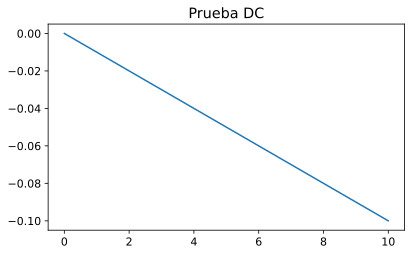


   **Pregunta:** comenta la gráfica anterior… ¿qué estamos viendo
   exactamente? Etiqueta los ejes de la misma convenientemente. Así como
   ningún número puede *viajar* solo sin hacer referencia a su
   naturaleza, ninguna gráfica puede estar sin sus ejes convenientemente
   etiquetados. Algo de
   `ayuda <https://matplotlib.org/3.1.0/gallery/pyplots/fig_axes_labels_simple.html>`__.
   ¿Qué biblioteca estamos usando para graficar? Una
   `pista <https://matplotlib.org>`__.

   **Respuesta:**

..

   La gráfica está mostrando diferencia de potencia (V) en el eje x, y
   corriente o intensidad (A) en el eje y.

   Si tomamos los valores como absolutos, puesto que el signo solo
   representa el sentido del flujo de los electrones, se ve como
   conforme aumenta la diferencia de potencial aumenta linealmente la
   corriente, y esto, según la Ley de Ohm debería de pasar a razón de la
   carga o resistencia. Puesto que la carga de nuestro circuito ofrece
   una resistencia de :math:`\mathrm{100\Omega}`, para, por ejemplo
   :math:`\mathrm{4v}`, según la ley de Ohm tendríamos:

   .. math:: \mathrm{V}=\mathrm{R}\cdot\mathrm{I}

   .. math:: \mathrm{I}=\frac{\mathrm{V}}{\mathrm{R}}=\frac{\mathrm{4v}}{\mathrm{100\Omega}}=\mathrm{0.04A}

..

   Aquí la gráfica con sus ejes convenientemente etiquetados:

.. code:: ipython3

    plot.rcParams['figure.figsize'] = [6.4, 3.8]
    plot.rcParams['font.size'] = 12
    
    fig, ax = plot.subplots()
    ax.plot(resultados['dc']['Vn001'], resultados['dc']['I(V1)'])
    ax.set(xlabel='Voltaje (V)', ylabel='Intensidad (A)',
           title='Circuito VDC ($\mathrm{10v}$) - Resistencia $\mathrm{100\ \Omega}$')
    ax.grid()
    plot.show()


### Resultados de la simulación ``.op`` El método ``.results`` nos
devuelve un diccionario con los resultados de la simulación.

.. code:: ipython3

    print(resultados['op'].results)


.. parsed-literal::

    {VN001: 9.0, I(V1): -0.09}
    

   **Pregunta:** justifica el sencillo resultado anterior (análisis
   ``op``). Repite el cálculo con Sympy, atendiendo con mimo a las
   unidades y al formateo de los resultados (tal y como hemos visto en
   muchos otros notebooks en clase).

   **Respuesta:**

..

   Puesto que la carga de nuestro circuito ofrece una resistencia de
   :math:`\mathrm{100\Omega}`, para :math:`\mathrm{9v},` según la ley de
   Ohm tendríamos:

   .. math:: \mathrm{V}=\mathrm{R}\cdot\mathrm{I}

   .. math:: \mathrm{I}=\frac{\mathrm{V}}{\mathrm{R}}=\frac{\mathrm{9v}}{100\mathrm{\Omega}}=\mathrm{0.09A}

   Con Sympy:

.. code:: ipython3

    voltaje = 9 * volts
    resistencia = 100 * ohms
    intensidad = symbols('i')
    ley_ohm = Eq(voltaje, resistencia*intensidad)
    corriente = solve(ley_ohm, intensidad)
    corriente = convert_to(corriente[0], [amperes]).n(2)
    print("Si tenemos una fuente de " + str(voltaje) + " y una resistencia de " + str(resistencia) + "\nla intensidad en amperios es:")
    corriente


.. parsed-literal::

    Si tenemos una fuente de 9*volt y una resistencia de 100*ohm
    la intensidad en amperios es:
    


.. math::

    \displaystyle 0.09 \text{A}


## Resolución del mismo circuito pero con LTspice Por comodidad, creamos
un alias del comando que apunte al ejecutable de LTspice. Como es
evidente, este paso requiere tener instalado LTspice en la carpeta por
defecto.

.. code:: ipython3

    get_ipython().run_line_magic(
        'alias', 'lts /Applications/LTspice.app/Contents/MacOS/LTspice -ascii -b')
    if platform.system() == "Windows":
        get_ipython().run_line_magic(
            'alias', 'lts "C:\\Program Files\\LTC\\LTspiceXVII\\XVIIx64.exe" -ascii -b ')

   **Pregunta**: ¿Qué significan las opciones ``-b`` y ``-ascii``? Algo
   de ayuda
   `aquí <http://ltwiki.org/LTspiceHelp/LTspiceHelp/Command_Line_Switches.htm>`__.

   **Respuesta:**

..

   -  ``-b`` establece la ejecución por lotes. Los datos resultantes se
      guardarán en un ``archivo.raw``
   -  ``-ascii`` indica que los ``archivos.raw`` deben de generarse en
      formato ASCII

También tenemos que cambiar ligeramente la sintaxis. Ejecuta esta línea
para que se escriba el fichero siguiente. Para LTspice, vamos a reservar
la extensión ``.net``:

.. code:: ipython3

    %%writefile 'files\circuito_sencillo.net'
    * Este es un circuito sencillo adaptado para LTspice
    r1 1 0 100
    v1 0 1 9
    .op
    * Comentamos el análisis .dc para centrarnos primero en el .op
    * .dc v1 1 10 
    .end


.. parsed-literal::

    Writing files\circuito_sencillo.net
    

Ejecutamos LTspice con el circuito (de la misma manera que antes
habíamos hecho con Ahkab).

Pare ello usaremos el alias de ejecutable y le pasamos por parámetro el
archivo que acabamos de crear.

.. code:: ipython3

    lts "files\circuito_sencillo.net"

Esto habrá generado dos archivos, un ``.log`` y un .raw, con el
resultado de la simulación. Veamos su contenido.

## Contenido del ``.log``:

.. code:: ipython3

    get_ipython().run_line_magic('pycat', 'files\circuito_sencillo.log')

## Contenido del ``.raw``:

.. code:: ipython3

    get_ipython().run_line_magic('pycat', 'files\circuito_sencillo.raw')

Ahora repitamos lo mismo para el análisis ``.dc``:

.. code:: ipython3

    %%writefile 'files\circuito_sencillo.net'
    * Este es un circuito sencillo adaptado para LTspice
    r1 1 0 100
    v1 0 1 9
    * Comentamos el análisis .op para centrarnos primero en el .dc
    * .op
    .dc v1 1 10 10
    .end


.. parsed-literal::

    Overwriting files\circuito_sencillo.net
    

.. code:: ipython3

    lts "files\circuito_sencillo.net"

Al ejecutar esta simulación para el análisis ``.dc``, el fichero
``.raw`` con los resultados es muchísimo más extenso. Para leer este
fichero, y además, extraer los valores para la gráfica vamos a usar el
paquete `ltspice de
Python <https://github.com/DongHoonPark/ltspice_pytool>`__, el cual se
puede instalar directamente desde Jupyter

.. code:: ipython3

    get_ipython().system('pip install ltspice')


.. parsed-literal::

    Requirement already satisfied: ltspice in c:\users\joseh\scoop\apps\miniconda3\current\lib\site-packages (1.0.0)
    Requirement already satisfied: numpy in c:\users\joseh\scoop\apps\miniconda3\current\lib\site-packages (from ltspice) (1.19.1)
    

Ahora leemos el fichero ``.raw`` y dibujamos la gráfica con los datos
obtenidos con LTspice:

.. code:: ipython3

    l = ltspice.Ltspice("files\circuito_sencillo.raw")
    l.parse()
    tiempo = l.get_time()
    voltaje = l.get_data('v1')
    corriente = l.get_data('I(V1)')
    
    plot.rcParams['figure.figsize'] = [6.4, 3.8]
    plot.rcParams['font.size'] = 12
    
    fig, ax = plot.subplots()
    
    ax.set(xlabel='Voltaje (V)', ylabel='Intensidad (A)',
           title='Circuito VDC ($\mathrm{10v}$) - Resistencia $\mathrm{100\ \Omega}$')
    ax.plot(voltaje, corriente)
    plot.show()


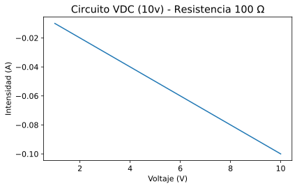


## Análisis de circuito con resistencias en serie

Vamos a resolver (en punto de operación) el siguiente circuito, que
consta de 3 resistencias en serie de :math:`\mathrm{3k\Omega}`,
:math:`\mathrm{10k\Omega}` y :math:`\mathrm{5k\Omega}` respectivamente:

|image1|

Al igual que antes, grabamos el netlist en disco desde Jupyter con los
datos representativos del circuito comentado. Para ello usamos la
*palabra mágica*
```%writefile`` <https://ipython.readthedocs.io/en/stable/interactive/magics.html#cellmagic-writefile>`__.
Más info
`aquí <https://ipython.readthedocs.io/en/stable/interactive/magics.html#cellmagic-writefile>`__.

.. |image1| image:: https://raw.githubusercontent.com/pammacdotnet/spicelab/master/resistencias%20en%20serie.svg?sanitize=true

.. code:: ipython3

    %%writefile "files\resistencias_en_serie.net"
    * circuito con tres resistencias en serie
    v1 1 0 type=vdc vdc=9
    R1 0 2 3k
    R2 2 3 10k  
    R3 3 1 5k
    * análisis del circuito
    .op
    .end


.. parsed-literal::

    Writing files\resistencias_en_serie.net
    

Haciendo uso de la librería ``Ahkab`` procesamos el circuito que
acabamos de definir.

.. code:: ipython3

    circuito_y_análisis = ahkab.netlist_parser.parse_circuit('files\\resistencias_en_serie.net')

El método ``ahkab.netlist_parser.parse_circuit()`` ha creado una lista
en cuya primera posición se ha guardado la lista de componentes y sus
conexiones, y en la segunda posición, la listas de análisis que se
quieren realizar durante la simulación.

Extraemos estos datos a sendas variables.

.. code:: ipython3

    netlist = circuito_y_análisis[0]
    análisis_en_netlist = circuito_y_análisis[1]

Ahora con el método ``ahkab.netlist_parser.parse_analysis()`` generamos
una lista con las operaciones de análisis que se realizaran durante la
simulación. Cada elemento de la lista contendrá el tipo de análisis a
realizar (dc, tran, etc.) y los parámetros con los que se realizará cada
análisis.

.. code:: ipython3

    lista_de_análisis = ahkab.netlist_parser.parse_analysis(netlist, análisis_en_netlist)
    print(lista_de_análisis)


.. parsed-literal::

    [{'type': 'op', 'guess': True, 'x0': None}]
    

Podemos usar lo que hemos definido durante el circuito anterior para
añadir el archivo temporal ``.tsv`` si fuera necesario, aunque ahora no
haría falta, puesto que no hemos establecido ningún análisis ``.dc`` ni
``.tran``

.. code:: ipython3

    for analisis in [d for i, d in enumerate(lista_de_análisis) if "dc" in d.values() or "tran" in d.values()]:
        analisis['outfile'] = files_directory + "simulación_" + analisis['type'] + ".tsv"

Ya tenemos lo necesario para ejecutar las simulaciones. Esto lo haremos
usando el método ``.run`` de Ahkab

.. code:: ipython3

    resultados = ahkab.run(netlist, lista_de_análisis)


.. parsed-literal::

    Starting op analysis:
    Calculating guess: skipped. (linear circuit)
    Solving...   done.
    Solving...   done.
    Difference check within margins.
    (Voltage: er=0.001, ea=1e-06, Current: er=0.001, ea=1e-09)
    

Imprimimos los resultados del análisis ``.op``:

.. code:: ipython3

    print(resultados['op'])


.. parsed-literal::

    OP simulation results for '* circuito con tres resistencias en serie'(netlist files\resistencias_en_serie.net).
    Run on 2021-01-02 19:45:04, data file None.
    Variable    Units      Value     Error    %
    ----------  -------  -------  --------  ---
    V1          V         9       -9e-12      0
    V2          V         1.5     -1.5e-12    0
    V3          V         6.5     -6.5e-12    0
    I(V1)       A        -0.0005   0          0
    

Los valores ``V1``, ``V2`` y ``V3`` representan la diferencia de
potencial (V) que hay entre los bornes de las conexiones ``1``, ``2`` y
``3`` definidas en el netlist y masa, que es el borne ``0``, es decir,
la conexión entre la pila y ``R1``:
>\ ``spice  v1 1 0 type=vdc vdc=9  R1 0 2 3k  R2 2 3 10k  R3 3 1 5k``

-  ``V1`` es la diferencia de potencial entre la conexión de la pila con
   ``R3`` y masa.
-  ``V2`` es la diferencia de potencial entre la conexión de ``R1`` con
   ``R2`` y masa.
-  ``V3`` es la diferencia de potencial entre la conexión de ``R2`` con
   ``R3`` y masa.

### **Ejercicio**:

Comprueba que podemos calcular el *potencial consumido* por la
resistencia ``R1`` y verás que coincide con el del punto ``V2`` devuelto
por Ahkab.

### **Respuesta**:

Huelga decir que la carga de dos resistencias en serie es la suma de sus
cargas, por lo que podríamos tratar el circuito como si de dos
resistencias en serie se tratara. Una sería ``R1``
:math:`\mathrm{(3k\Omega)}` y la otra la suma de ``R2``\ +\ ``R3``
:math:`(\mathrm{10k\Omega}+\mathrm{5k\Omega}=\mathrm{15k\Omega})` y la
carga total sería ``R1``\ +\ ``R2``\ +\ ``R3``
:math:`(\mathrm{3k\Omega}+\mathrm{10k\Omega}+\mathrm{5k\Omega}=\mathrm{18k\Omega})`

Si calculamos manualmente la corriente, sabiendo que tenemos una
diferencia de potencial de :math:`\mathrm{9v}` a los extremos de la
pila, tenemos que:

.. math:: \mathrm{V}=\mathrm{R}\cdot\mathrm{I}

.. math:: \mathrm{I}=\frac{\mathrm{V}}{\mathrm{R}}=\frac{\mathrm{9v}}{\mathrm{18k\Omega}}=\mathrm{0.5\ mA}

Que se corresponde con los :math:`\mathrm{0.0005\ A}` que nos ha
devuelto ``Ahkab`` para ``I(V1)``

Puesto que las resistencias están en serie, el flujo de electrones en
cada resistencia debe de ser el mismo, en concreto el equivalente a
:math:`\mathrm{0.5\ mA}`. Por tanto podemos calcular la caída de
potencial en cada resistencia.

.. math:: \mathrm{V_1}=\mathrm{R_1}\cdot\mathrm{I}=\mathrm{3k\Omega}\cdot\mathrm{0.5\ mA}=\mathrm{1.5v}

.. math:: \mathrm{V_2}=\mathrm{R_2}\cdot\mathrm{I}=\mathrm{10k\Omega}\cdot\mathrm{0.5\ mA}=\mathrm{5v}

.. math:: \mathrm{V_3}=\mathrm{R_3}\cdot\mathrm{I}=\mathrm{5k\Omega}\cdot\mathrm{0.5\ mA}=\mathrm{2.5v}

Como se puede observar, la suma de las caídas de potencial es
exactamente la diferencia de potencial en los extremos de la pila, que
también son los extremos de las tres resistencias.

.. math:: \mathrm{V}=\mathrm{V_1}+\mathrm{V_2}+\mathrm{V_3}=\mathrm{1.5v}+\mathrm{5v}+\mathrm{2.5v}=\mathrm{9v}

#### Comprobemos si coincide lo que dice ``Ahkab`` y ``V2`` es
:math:`\mathrm{1.5v}`.

La suma de las caídas de potencial de las resistencias ``R2``\ +\ ``R3``
es :math:`\mathrm{5v}+\mathrm{2.5v}=\mathrm{7.5v}`.

### ¿Porque no coincide? Si nos fijamos bien en el netlist:
``spice  v1 1 0 type=vdc vdc=9  R1 0 2 3k  R2 2 3 10k  R3 3 1 5k``

Vemos que el orden en el que se han definido las resistencias es este:

``+Vcc`` )—**1**—( ``R3`` )—**3**—( ``R2`` )—**2**—( ``R1`` )—**0**—(
``Gnd``

Aquí el borne 2 tiene entre él y masa únicamente a ``R1``. Según
nuestros cálculos la caída de potencial en ``R1`` es de
:math:`=\mathrm{1.5v}` y sí que coincide con lo que dice ``Ahkab`` para
``V2``, que es :math:`\mathrm{1.5v}`

### Entonces, ¿Dónde está el error? Si observamos el esquema:

|image1|

Primer fallo. No coincide el orden de las resistencias con el del
netlist. El orden sería este:

``+Vcc`` )—**1**—( ``R1`` )—**3**—( ``R2`` )—**2**—( ``R3`` )—**0**—(
``Gnd``

Pero además, para el cálculo hemos interpretado que entre el borne 2 y
masa había dos resistencias, por lo que el orden correcto de las
resistencias y de las conexiones para que se ajuste a los cálculos sería
este:

``+Vcc`` )—**1**—( ``R1`` )—**2**—( ``R2`` )—**3**—( ``R3`` )—**0**—(
``Gnd``

.. |image1| image:: https://raw.githubusercontent.com/pammacdotnet/spicelab/master/resistencias%20en%20serie.svg?sanitize=true

### Vamos a comprobarlo

Volvemos a definir el netlist, esta vez para el orden coincida con los
cálculos que hemos realizado.

``v1`` )—**1**—( ``R1`` )—**2**—( ``R2`` )—**3**—( ``R3`` )—**0**—(
``v1``
>\ ``spice  v1 1 0 type=vdc vdc=9  R1 1 2 3k  R2 2 3 10k  R3 3 0 5k``

.. code:: ipython3

    %%writefile "files\resistencias_en_serie.net"
    * circuito con tres resistencias en serie
    v1 1 0 type=vdc vdc=9 
    R1 1 2 3k  
    R2 2 3 10k    
    R3 3 0 5k  
    * análisis del circuito
    .op
    .end


.. parsed-literal::

    Overwriting files\resistencias_en_serie.net
    

Volvemos a procesar el circuito con ``Ahkab`` y extraemos los datos.

.. code:: ipython3

    # Procesar circuito
    circuito_y_análisis = ahkab.netlist_parser.parse_circuit('files\\resistencias_en_serie.net')
    # Separar datos netlist y simulaciones
    netlist = circuito_y_análisis[0]
    análisis_en_netlist = circuito_y_análisis[1]
    # Extraer datos de simulaciones
    lista_de_análisis = ahkab.netlist_parser.parse_analysis(netlist, análisis_en_netlist)
    # Establecer condiciones óptimas para los análisis `.dc` y/o `.tran` si lo hay.
    for analisis in [d for i, d in enumerate(lista_de_análisis) if "dc" in d.values() or "tran" in d.values()]:
        analisis['outfile'] = files_directory + "simulación_" + analisis['type'] + ".tsv"

Ejecutamos las simulaciones para el nuevo circuito y mostramos el
resultado de la simulación ``.op``.

.. code:: ipython3

    resultados = ahkab.run(netlist, lista_de_análisis)
    print(resultados['op'])


.. parsed-literal::

    Starting op analysis:
    Calculating guess: skipped. (linear circuit)
    Solving...   done.
    Solving...   done.
    Difference check within margins.
    (Voltage: er=0.001, ea=1e-06, Current: er=0.001, ea=1e-09)
    OP simulation results for '* circuito con tres resistencias en serie'(netlist files\resistencias_en_serie.net).
    Run on 2021-01-02 19:45:04, data file None.
    Variable    Units      Value     Error    %
    ----------  -------  -------  --------  ---
    V1          V         9       -9e-12      0
    V2          V         7.5     -7.5e-12    0
    V3          V         2.5     -2.5e-12    0
    I(V1)       A        -0.0005   0          0
    

### FANTÁSTICO !!! Ahora sí coinciden los resultados. Podemos ver que
``V2`` corresponde con la caída calculada. Además, también V3 coincide
con la caída calculada para la R3 que era de :math:`\mathrm{2.5v}`

### Comprobamos con Sympy Comprobamos con Sympy que para la corriente
obtenida de la simulación, una resistencia de :math:`\mathrm{3k\Omega}`
provoca una caída de potencial de :math:`\mathrm{1.5v}`

.. code:: ipython3

    r1 = 3E3*ohms
    int=resultados['op']['I(V1)']
    intensidad_ahkab = resultados['op']['I(V1)'][0][0]*amperes
    v2 = convert_to(intensidad_ahkab*r1, [volts])
    v2


.. math::

    \displaystyle - 1.5 \text{V}


### **Pregunta**:

   Reproduce el resto de los valores anteriores de manera *manual*
   mediante Sympy (es decir, aplicando la ley de Ohm, pero con un *toque
   computacional*). Te pongo aquí un ejemplo del que puedes partir… En
   él sólo calculo la corriente que circula por el circuito (sí, justo
   la que antes Ahkab ha devuelto de manera automática). Para ello
   necesito previamente computar la resistencia total (``r_total``).
   Faltarían el resto de resultados y convertirlos a unidades más
   *vistosas* (mediante la orden ``convert_to`` y ``.n()``).

.. code:: ipython3

    v1 = 9*volts
    r1 = 3*kilo*ohms
    r2 = 10*kilo*ohms
    r3 = 5*kilo*ohms
    r_total = r1 + r2 + r3
    intensidad = symbols('i')
    ley_ohm = Eq(v1, intensidad*r_total)
    solucion_para_intensidad = solve(ley_ohm, intensidad)
    convert_to(solucion_para_intensidad[0], [amperes]).n(2)


.. math::

    \displaystyle 0.0005 \text{A}


### **Respuesta**: Supondremos el orden de las resistencias igual que el
del circuito del esquema, es decir, igual que el de los cálculos que
hemos hecho a mano.

.. code:: ipython3

    print("Voltaje entre extremos de R1:")
    voltaje = symbols('v')
    ley_ohm = Eq(voltaje, solucion_para_intensidad[0]*r1)
    solucion_para_voltaje_R1 = solve(ley_ohm, voltaje)
    convert_to(solucion_para_voltaje_R1[0], [volts]).n(2)


.. parsed-literal::

    Voltaje entre extremos de R1:
    


.. math::

    \displaystyle 1.5 \text{V}


.. code:: ipython3

    print("Voltaje entre extremos de R2:")
    voltaje = symbols('v')
    ley_ohm = Eq(voltaje, solucion_para_intensidad[0]*r2)
    solucion_para_voltaje_R2 = solve(ley_ohm, voltaje)
    convert_to(solucion_para_voltaje_R2[0], [volts]).n(2)


.. parsed-literal::

    Voltaje entre extremos de R2:
    


.. math::

    \displaystyle 5.0 \text{V}


.. code:: ipython3

    print("Voltaje entre extremos de R3:")
    voltaje = symbols('v')
    ley_ohm = Eq(voltaje, solucion_para_intensidad[0]*r3)
    solucion_para_voltaje_R3 = solve(ley_ohm, voltaje)
    convert_to(solucion_para_voltaje_R3[0], [volts]).n(2)


.. parsed-literal::

    Voltaje entre extremos de R3:
    


.. math::

    \displaystyle 2.5 \text{V}


.. code:: ipython3

    print("Voltaje entre conexión R1-R2 y masa:")
    voltaje = symbols('v')
    ley_ohm = Eq(voltaje, solucion_para_intensidad[0]*(r2+r3))
    solucion_para_voltaje_R2_masa = solve(ley_ohm, voltaje)
    convert_to(solucion_para_voltaje_R2_masa[0], [volts]).n(2)


.. parsed-literal::

    Voltaje entre conexión R1-R2 y masa:
    


.. math::

    \displaystyle 7.5 \text{V}


.. code:: ipython3

    print("Voltaje entre VCC y conexión R2-R3:")
    voltaje = symbols('v')
    ley_ohm = Eq(voltaje, solucion_para_intensidad[0]*(r1+r2))
    solucion_para_voltaje_VCC_R3 = solve(ley_ohm, voltaje)
    convert_to(solucion_para_voltaje_VCC_R3[0], [volts]).n(2)


.. parsed-literal::

    Voltaje entre VCC y conexión R2-R3:
    


.. math::

    \displaystyle 6.5 \text{V}


### **Pregunta**: > Demuestra que se cumple la Ley de Kirchhoff de la
energía en un circuito, es decir, que la suma de la energía suministrada
por las fuentes (pilas) es igual a la consumida por las resistencias.
Realiza la operación con Sympy.

   .. math::


      \sum_i^N V_{\text{fuentes}} = \sum_j^M V_{\text{consumido en resistencias}}

   Ten en cuenta que en este caso sólo hay una fuente.

### **Respuesta**: Vaya, parece que nos adelantado a este punto, la
respuesta a esto está en el apartado anterior. Podemos comprobar que la
suma de los voltajes en cada resistencia es igual al voltaje
suministrado por la pila.

.. code:: ipython3

    print("Suma de los voltajes de cada resistencia:")
    voltaje_resistencias = solucion_para_voltaje_R1[0] + solucion_para_voltaje_R2[0] + solucion_para_voltaje_R3[0]
    convert_to(voltaje_resistencias, [volts]).n(2)


.. parsed-literal::

    Suma de los voltajes de cada resistencia:
    


.. math::

    \displaystyle 9.0 \text{V}


## Análisis ``.op`` de circuitos con resistencias en paralelo

Vamos a complicar un poco el trabajo añadiendo elementos en paralelo.

   **Pregunta**: realiza los análisis ``.op`` de los siguientes
   circuitos. Para ello crea un netlist separado para cada uno donde
   queden correctamente descritos junto con la simulación (``.op``).
   Comenta los resultados que devuelve Ahkab (no imprimas los resultados
   de las simulaciones *sin más*).

|image1|

Aquí tienes el análisis del primer circuito, para que sirva de ejemplo:

.. |image1| image:: https://raw.githubusercontent.com/pammacdotnet/spicelab/master/resistencias%20en%20paralelo.svg?sanitize=true

### **Análisis del primer circuito**

|image1|

Definimos el netlist del primer circuito paralelo.

.. |image1| image:: https://raw.githubusercontent.com/tikissmikiss/Laboratorio-LTspice/master/resource/Circuito_paralelo_1_lab_fisica.svg?sanitize=true

.. code:: ipython3

    %%writefile "files\resistencias_en_paralelo_1.cir"
    * resistencias en paralelo
    vdd 0 1 vdc=12 type=vdc
    r2 1 2 1k
    r3 2 3 220
    r4 3 0 1.5k
    r5 2 0 470
    .op
    .end


.. parsed-literal::

    Writing files\resistencias_en_paralelo_1.cir
    

Procesamos el circuito con ``Ahkab`` y extraemos los datos.

.. code:: ipython3

    # Procesar circuito
    circuito_y_análisis = ahkab.netlist_parser.parse_circuit('files\\resistencias_en_paralelo_1.cir')
    # Separar datos netlist y simulaciones
    netlist = circuito_y_análisis[0]
    análisis_en_netlist = circuito_y_análisis[1]
    # Extraer datos de simulaciones
    lista_de_análisis = ahkab.netlist_parser.parse_analysis(netlist, análisis_en_netlist)
    # Establecer condiciones óptimas para los análisis `.dc` y/o `.tran` si lo hay.
    for analisis in [d for i, d in enumerate(lista_de_análisis) if "dc" in d.values() or "tran" in d.values()]:
        analisis['outfile'] = files_directory + "simulación_" + analisis['type'] + ".tsv"

Ejecutamos la simulación

.. code:: ipython3

    resultados = ahkab.run(netlist, lista_de_análisis)


.. parsed-literal::

    Starting op analysis:
    Calculating guess: skipped. (linear circuit)
    Solving...   done.
    Solving...   done.
    Difference check within margins.
    (Voltage: er=0.001, ea=1e-06, Current: er=0.001, ea=1e-09)
    

Imprimimos los resultados del análisis ``.op``. Como puedes comprobar,
Ahkab sólo reporta la intensidad de corriente en las ramas en las que
hay una pila (en este caso, la rama donde está la pila ``VDD``).

.. code:: ipython3

    print(resultados['op'])


.. parsed-literal::

    OP simulation results for '* resistencias en paralelo'(netlist files\resistencias_en_paralelo_1.cir).
    Run on 2021-01-02 19:45:05, data file None.
    Variable    Units           Value        Error    %
    ----------  -------  ------------  -----------  ---
    V1          V        -12           1.2e-11        0
    V2          V         -3.23533     3.23532e-12    0
    V3          V         -2.8215      2.82151e-12    0
    I(VDD)      A         -0.00876467  0              0
    

### **Pregunta:**

   Inserta dos *pilas virtuales* de 0 voltios en el resto de ramas del
   circuito (``Vdummy1`` en la rama donde está ``R5`` y ``Vdummy2`` en
   la rama donde está ``R3`` y ``R4``) para que Ahkab nos imprima
   también la corriente en las mismas. Es muy parecido al tercer
   circuito que tienes que resolver, donde ``V1``, ``V2`` y ``V3``
   tienen cero voltios. Estas *pilas nulas* son, a todos los efectos,
   *simples cables*. Una vez que ya tienes las corrientes en todas las
   ramas, comprueba que se cumple la Ley de Kirchhoff para las
   corrientes:

..

   .. math:: I_{\text{entrante}} = \sum_i^{N} I_{\text{salientes}}

   Repite lo mismo para los otros dos circuitos. Realiza además los
   cálculos con Sympy (recalcula los mismos voltajes que devuelve Ahkab
   a partir de la corriente que sí te devuelve la simulación) y cuidando
   de no olvidar las unidades. Recuerda que el objeto ``resultados``
   alberga toda la información que necesitas de manera indexada. Ya han
   aparecido un ejemplo más arriba. Es decir: no *copies* los números *a
   mano*, trabaja de manera informáticamente elegante (usando la
   variable ``resultados``).

### **Respuesta** Definimos el netlist con las dos pilas de
:math:`\mathrm{0v}`

.. code:: ipython3

    %%writefile "files\resistencias_en_paralelo_1.cir"
    * resistencias en paralelo
    vdd 1 0 vdc=12 type=vdc
    Vdummy1 4 0 vdc=0 type=vdc
    Vdummy2 5 0 vdc=0 type=vdc
    r2 1 2 1k
    r3 2 3 220
    r4 3 5 1.5k
    r5 2 4 470
    .op
    .end


.. parsed-literal::

    Overwriting files\resistencias_en_paralelo_1.cir
    

Procesamos el circuito con ``Ahkab`` y extraemos los datos.

.. code:: ipython3

    # Procesar circuito
    circuito_y_análisis = ahkab.netlist_parser.parse_circuit('files\\resistencias_en_paralelo_1.cir')
    # Separar datos netlist y simulaciones
    netlist = circuito_y_análisis[0]
    análisis_en_netlist = circuito_y_análisis[1]
    # Extraer datos de simulaciones
    lista_de_análisis = ahkab.netlist_parser.parse_analysis(netlist, análisis_en_netlist)
    # Establecer condiciones óptimas para los análisis `.dc` y/o `.tran` si lo hay.
    for analisis in [d for i, d in enumerate(lista_de_análisis) if "dc" in d.values() or "tran" in d.values()]:
        analisis['outfile'] = files_directory + "simulación_" + analisis['type'] + ".tsv"

Ejecutamos la simulación

.. code:: ipython3

    resultados = ahkab.run(netlist, lista_de_análisis)


.. parsed-literal::

    Starting op analysis:
    Calculating guess: skipped. (linear circuit)
    Solving...   done.
    Solving...   done.
    Difference check within margins.
    (Voltage: er=0.001, ea=1e-06, Current: er=0.001, ea=1e-09)
    

Imprimimos los resultados del análisis ``.op``.

.. code:: ipython3

    print(resultados['op'])


.. parsed-literal::

    OP simulation results for '* resistencias en paralelo'(netlist files\resistencias_en_paralelo_1.cir).
    Run on 2021-01-02 19:45:05, data file None.
    Variable    Units          Value         Error    %
    ----------  -------  -----------  ------------  ---
    V1          V        12           -1.2e-11        0
    V4          V         0           -8.67362e-19    0
    V5          V         0            0              0
    V2          V         3.23533     -3.23532e-12    0
    V3          V         2.8215      -2.82151e-12    0
    I(VDD)      A        -0.00876467   0              0
    I(VDUMMY1)  A         0.00688367   0              0
    I(VDUMMY2)  A         0.001881     0              0
    

Como podemos ver la suma de las corrientes de las pilas dummy es igual a
la corriente total. Comprobémoslos.

La corriente total es:

.. code:: ipython3

    intensidad = -resultados['op'].results._dict['I(VDD)']*amperes
    convert_to(intensidad, [amperes]).n(5)


.. math::

    \displaystyle 0.0087647 \text{A}


La suma de las corrientes de la pilas dummy es:

.. code:: ipython3

    intensidad_dummy1 = resultados['op'].results._dict['I(VDUMMY1)']*amperes
    intensidad_dummy2 = resultados['op'].results._dict['I(VDUMMY2)']*amperes
    convert_to(intensidad_dummy1+intensidad_dummy2, [amperes]).n(5)


.. math::

    \displaystyle 0.0087647 \text{A}


GENIAL !!! Se cumple la Ley de Kirchhoff

### Comprobemos el resultado de ``Ahkab`` con Sympy Ahora tenemos
resistencias en paralelo, por lo que ya no podemos sumar sus
resistencias para averiguar la resistencia total del circuito.

¿Como afecta la carga resistiva de dos resistencias en paralelo a la
carga total?

Antes de responder a esta pregunta calculemos la resistencia total con
los datos de los que disponemos.

Nótese que no existen resistencias negativas, ya que son componentes
pasivos. Puesto que ``Ahkab`` nos está dando la corriente en negativo,
le invertimos el signo para que la resistencia resulte positiva.

.. code:: ipython3

    v1 = 12*volts
    r2 = 1*kilo*ohms
    r3 = 220*ohms
    r4 = 1.5*kilo*ohms
    r5 = 470*ohms
    intensidad = -resultados['op'].results._dict['I(VDD)']*amperes 
    resistencia = symbols('r')
    ley_ohm = Eq(v1, intensidad*resistencia)
    resistencia_total = solve(ley_ohm, resistencia)
    convert_to(resistencia_total[0], [ohms]).n(5)


.. math::

    \displaystyle 1369.1 \Omega


Como ya sabemos, la resistencia total de cargas en serie es la suma de
sus resistencias. Ahora que conocemos la resistencia total, la
resistencia equivalente de las dos mallas formadas por ``R3``, ``R4`` y
``R5``, solo puede ser la resistencia total menos la resistencia de
``R2``

.. code:: ipython3

    r_subcircuito = resistencia_total[0] - r2
    convert_to(r_subcircuito, [ohms]).n(5)


.. math::

    \displaystyle 369.13 \Omega


Gracias a ``Ahkab`` conocemos la corriente total y también el voltaje en
el borne 2. Comprobemos con estos datos que la resistencia que acabamos
de obtener es correcta.

.. code:: ipython3

    v = resultados['op'].results._dict['V2']*volts
    i = -resultados['op'].results._dict['I(VDD)']*amperes 
    resistencia = symbols('r')
    ley_ohm = Eq(v, i*resistencia)
    r_subcircuito = solve(ley_ohm, resistencia)
    convert_to(r_subcircuito[0], [ohms]).n(5)


.. math::

    \displaystyle 369.13 \Omega


Conocemos la resistencia de cada maya, ya que una es ``R5`` y la otra
``R3``\ +\ ``R4``. Esto es :math:`R_{m1}=\mathrm{470\ \Omega}` y
:math:`R_{m2}=\mathrm{1720\ \Omega}`, pero la resistencia equivalente es
inferior a la de cualquiera de las dos mallas. ¿Porqué? ¿Qué está
pasando?

Veámoslo con números más redondos. Supongamos que una pila de
:math:`\mathrm{10\ v}` aporta una corriente de :math:`\mathrm{1\ A}` a
un circuito con dos cargas en paralelo, de las que no conocemos sus
resistencias, pero sabemos que son iguales.

La resistencia equivalente sería
:math:`\frac{\mathrm{10\ v}}{\mathrm{1\ A}}=\mathrm{10\ \Omega}`

Para que se cumpla la Ley de Kirchhoff, por cada rama deben circular
:math:`\mathrm{0.5\ A}`, por tanto la resistencias serán de
:math:`\mathrm{20\ \Omega}`

Vaya!!! la resistencia equivalente es justo la mitad del valor de las
resistencias si estas son iguales. Esto es porque para que se cumpla la
Ley de Kirchhoff, el flujo de electrones se tiene que repartir entre
cada malla proporcionalmente a su resistencia, y como ya hemos visto por
la ley de Ohm, esto sucede con una proporcionalidad lineal. Por lo que
la inversa de la resistencia equivalente será igual a la suma de las
inversas de cada malla.

Comprobemos esto con los datos que tenemos del circuito.

.. code:: ipython3

    inv_malla1 = 1/r5
    inv_malla2 = 1/(r3+r4)
    equiv = symbols('equiv')
    equiv = solve(1/equiv-inv_malla1-inv_malla2, equiv)
    convert_to(equiv[0], [ohms]).n(5)


.. math::

    \displaystyle 369.13 \Omega


Nos falta por comprobar que los voltajes de cada nodo devueltos por
``Ahkab`` son correctos. #### Voltaje en el nodo 2 según ``Ahkab``:")

.. code:: ipython3

    resultados['op'].results._dict['V2']*volts


.. math::

    \displaystyle 3.23532550693703 \text{V}


#### Comprobamos el voltaje en el nodo 2 con Sympy:")

.. code:: ipython3

    print("Voltaje en el nodo 2:")
    v = symbols('v')
    intensidad = -resultados['op'].results._dict['I(VDD)']*amperes 
    ley_ohm = Eq(v, intensidad*equiv[0])
    voltaje_V2 = solve(ley_ohm, v)
    convert_to(voltaje_V2[0], [volts]).n(3)


.. parsed-literal::

    Voltaje en el nodo 2:
    


.. math::

    \displaystyle 3.24 \text{V}


#### Voltaje en el nodo 3 según ``Ahkab``:")

.. code:: ipython3

    resultados['op'].results._dict['V3']*volts


.. math::

    \displaystyle 2.82150480256136 \text{V}


#### Comprobamos el voltaje en el nodo 3 con Sympy:")

.. code:: ipython3

    print("Voltaje en el nodo 3:")
    v = symbols('v')
    ley_ohm = Eq(v, intensidad_dummy2*r4)
    voltaje_V3 = solve(ley_ohm, v)
    convert_to(voltaje_V3[0], [volts]).n(3)


.. parsed-literal::

    Voltaje en el nodo 3:
    


.. math::

    \displaystyle 2.82 \text{V}


### **Análisis del segundo circuito**

|image1|

Definimos el netlist del segundo circuito paralelo. Nos adelantamos y
colocamos una pila de :math:`\mathrm{0\ v}` en la malla de las tres
resistencias en serie.

.. |image1| image:: https://raw.githubusercontent.com/tikissmikiss/Laboratorio-LTspice/master/resource/Circuito_paralelo_2_lab_fisica.svg?sanitize=true

.. code:: ipython3

    %%writefile "files\resistencias_en_paralelo_2.cir"
    * resistencias en paralelo
    v1 1 0 vdc=9 type=vdc
    v2 4 0 vdc=1.5 type=vdc
    vdummy 6 0 vdc=0 type=vdc
    r1 1 2 47
    r2 2 3 220
    r3 2 4 180
    r4 3 5 1k
    r5 5 6 560
    .op
    .end


.. parsed-literal::

    Writing files\resistencias_en_paralelo_2.cir
    

Procesamos el circuito con ``Ahkab`` y extraemos los datos.

.. code:: ipython3

    # Procesar circuito
    circuito_y_análisis = ahkab.netlist_parser.parse_circuit('files\\resistencias_en_paralelo_2.cir')
    # Separar datos netlist y simulaciones
    netlist = circuito_y_análisis[0]
    análisis_en_netlist = circuito_y_análisis[1]
    # Extraer datos de simulaciones
    lista_de_análisis = ahkab.netlist_parser.parse_analysis(netlist, análisis_en_netlist)
    # Establecer condiciones óptimas para los análisis `.dc` y/o `.tran` si lo hay.
    for analisis in [d for i, d in enumerate(lista_de_análisis) if "dc" in d.values() or "tran" in d.values()]:
        analisis['outfile'] = files_directory + "simulación_" + analisis['type'] + ".tsv"

Ejecutamos la simulación

.. code:: ipython3

    resultados = ahkab.run(netlist, lista_de_análisis)


.. parsed-literal::

    Starting op analysis:
    Calculating guess: skipped. (linear circuit)
    Solving...   done.
    Solving...   done.
    Difference check within margins.
    (Voltage: er=0.001, ea=1e-06, Current: er=0.001, ea=1e-09)
    

Imprimimos los resultados del análisis ``.op``.

.. code:: ipython3

    print(resultados['op'])


.. parsed-literal::

    OP simulation results for '* resistencias en paralelo'(netlist files\resistencias_en_paralelo_2.cir).
    Run on 2021-01-02 19:45:06, data file None.
    Variable    Units          Value         Error    %
    ----------  -------  -----------  ------------  ---
    V1          V         9           -8.99997e-12    0
    V4          V         1.5         -1.5e-12        0
    V6          V         0           -8.67362e-19    0
    V2          V         7.29441     -7.29442e-12    0
    V3          V         6.39285     -6.39285e-12    0
    V5          V         2.29487     -2.29487e-12    0
    I(V1)       A        -0.0362891    0              0
    I(V2)       A         0.0321912    0              0
    I(VDUMMY)   A         0.00409798   0              0
    

Comprobamos que se cumple la Ley de Kirchhoff para las corrientes

La corriente total es:

.. code:: ipython3

    intensidad_total = -resultados['op'].results._dict['I(V1)']*amperes
    convert_to(intensidad_total, [amperes]).n(5)


.. math::

    \displaystyle 0.036289 \text{A}


La suma de las corrientes de las mallas es:

.. code:: ipython3

    intensidad_malla1 = resultados['op'].results._dict['I(V2)']*amperes
    intensidad_malla2 = resultados['op'].results._dict['I(VDUMMY)']*amperes
    convert_to(intensidad_malla1+intensidad_malla2, [amperes]).n(5)


.. math::

    \displaystyle 0.036289 \text{A}


GENIAL !!! Se cumple la Ley de Kirchhoff

### Comprobemos los resultados de ``Ahkab`` con Sympy

Inicializamos variables:

.. code:: ipython3

    v1 = 9*volts
    v2 = 1.5*volts
    r1 = 47*ohms
    r2 = 220*ohms
    r3 = 180*ohms
    r4 = 1*kilo*ohms
    r5 = 560*ohms

Puesto que no sabemos cómo está afectando la pila que hay en serie con
``R3``, es más sencillo calcular la tensión en el nodo 2, restando a
``v1`` la diferencia de potencial entre extremos de ``R1``.

#### La diferencia de potencial en V2 según ``Ahkab`` es:

.. code:: ipython3

    resultados['op'].results._dict['V2']*volts


.. math::

    \displaystyle 7.29440996800155 \text{V}


#### Comprobamos diferencia de potencial en V2 con Sympy:

.. code:: ipython3

    v = symbols('v')
    ley_ohm = Eq(v, intensidad_total*r1)
    # calcular la tensión entre extremos de r1
    voltaje_R1 = solve(ley_ohm, v)
    voltaje_V2 = v1-voltaje_R1[0]
    convert_to(voltaje_V2, [volts]).n(3)


.. math::

    \displaystyle 7.29 \text{V}


Para calcular la diferencia de potencial en V3 aplicamos la *Ley de Ohm*
para la corriente devuelta por ``Ahkab`` en la pila dummy y la suma de
las resistencias ``R4`` y ``R5``.

#### La diferencia de potencial en V3 según ``Ahkab`` es:

.. code:: ipython3

    resultados['op'].results._dict['V3']*volts


.. math::

    \displaystyle 6.39285367982158 \text{V}


#### Comprobamos diferencia de potencial en V3 con Sympy:

.. code:: ipython3

    v = symbols('v')
    ley_ohm = Eq(v, intensidad_malla2*(r4+r5))
    voltaje_V3 = solve(ley_ohm, v)
    convert_to(voltaje_V3[0], [volts]).n(3)
    


.. math::

    \displaystyle 6.39 \text{V}


La diferencia de potencial en V4 es igual a la de la pila ``V2``.

#### La diferencia de potencial en V3 según ``Ahkab`` es:

.. code:: ipython3

    resultados['op'].results._dict['V4']*volts


.. math::

    \displaystyle 1.5 \text{V}


#### La diferencia de potencial en V4 con Sympy:

.. code:: ipython3

    voltaje_V4 = v2
    convert_to(voltaje_V4, [volts]).n(3)


.. math::

    \displaystyle 1.5 \text{V}


Para calcular la diferencia de potencial en V5 aplicamos la *Ley de Ohm*
para la corriente devuelta por ``Ahkab`` en la pila dummy y la
resistencias ``R5``.

#### La diferencia de potencial en V5 según ``Ahkab`` es:

.. code:: ipython3

    resultados['op'].results._dict['V5']*volts


.. math::

    \displaystyle 2.29487055173082 \text{V}


#### Comprobamos diferencia de potencial en V5 con Sympy:

.. code:: ipython3

    print("La diferencia de potencial en V5 es:")
    v = symbols('v')
    ley_ohm = Eq(v, intensidad_malla2*r5)
    voltaje_V5 = solve(ley_ohm, v)
    convert_to(voltaje_V5[0], [volts]).n(3)


.. parsed-literal::

    La diferencia de potencial en V5 es:
    


.. math::

    \displaystyle 2.29 \text{V}


### **Análisis del tercer circuito**

|image1|

Definimos el netlist del tercer circuito paralelo.

.. |image1| image:: https://raw.githubusercontent.com/tikissmikiss/Laboratorio-LTspice/master/resource/Circuito_paralelo_3_lab_fisica.svg?sanitize=true

.. code:: ipython3

    %%writefile "files\resistencias_en_paralelo_3.cir"
    * resistencias en paralelo
    v 1 0 vdc=9 type=vdc
    v1 1 2 vdc=0 type=vdc
    v2 1 3 vdc=0 type=vdc
    v3 1 4 vdc=0 type=vdc
    r1 2 0 10k
    r2 3 0 2k
    r3 4 0 1k
    .op
    .end


.. parsed-literal::

    Writing files\resistencias_en_paralelo_3.cir
    

Procesamos el circuito con ``Ahkab`` y extraemos los datos.

.. code:: ipython3

    # Procesar circuito
    circuito_y_análisis = ahkab.netlist_parser.parse_circuit('files\\resistencias_en_paralelo_3.cir')
    # Separar datos netlist y simulaciones
    netlist = circuito_y_análisis[0]
    análisis_en_netlist = circuito_y_análisis[1]
    # Extraer datos de simulaciones
    lista_de_análisis = ahkab.netlist_parser.parse_analysis(netlist, análisis_en_netlist)
    # Establecer condiciones óptimas para los análisis `.dc` y/o `.tran` si lo hay.
    for analisis in [d for i, d in enumerate(lista_de_análisis) if "dc" in d.values() or "tran" in d.values()]:
        analisis['outfile'] = files_directory + "simulación_" + analisis['type'] + ".tsv"

Ejecutamos la simulación

.. code:: ipython3

    resultados = ahkab.run(netlist, lista_de_análisis)


.. parsed-literal::

    Starting op analysis:
    Calculating guess: skipped. (linear circuit)
    Solving...   done.
    Solving...   done.
    Difference check within margins.
    (Voltage: er=0.001, ea=1e-06, Current: er=0.001, ea=1e-09)
    

Imprimimos los resultados del análisis ``.op``.

.. code:: ipython3

    print(resultados['op'])


.. parsed-literal::

    OP simulation results for '* resistencias en paralelo'(netlist files\resistencias_en_paralelo_3.cir).
    Run on 2021-01-02 19:45:06, data file None.
    Variable    Units      Value    Error    %
    ----------  -------  -------  -------  ---
    V1          V         9        -9e-12    0
    V2          V         9        -9e-12    0
    V3          V         9        -9e-12    0
    V4          V         9        -9e-12    0
    I(V)        A        -0.0144    0        0
    I(V1)       A         0.0009    0        0
    I(V2)       A         0.0045    0        0
    I(V3)       A         0.009     0        0
    

Comprobamos que se cumple la Ley de Kirchhoff para las corrientes

La corriente total es:

.. code:: ipython3

    intensidad_total = -resultados['op'].results._dict['I(V)']*amperes
    convert_to(intensidad_total, [amperes]).n(5)


.. math::

    \displaystyle 0.0144 \text{A}


La suma de las corrientes de las mallas es:

.. code:: ipython3

    intensidad_malla1 = resultados['op'].results._dict['I(V1)']*amperes
    intensidad_malla2 = resultados['op'].results._dict['I(V2)']*amperes
    intensidad_malla3 = resultados['op'].results._dict['I(V3)']*amperes
    convert_to(intensidad_malla1+intensidad_malla2+intensidad_malla3, [amperes]).n(5)


.. math::

    \displaystyle 0.0144 \text{A}


GENIAL !!! Se cumple la Ley de Kirchhoff

### Comprobemos los resultados de ``Ahkab`` con Sympy

Inicializamos variables:

.. code:: ipython3

    v = 9*volts
    r1 = 10*kilo*ohms
    r2 = 2*kilo*ohms
    r3 = 1*kilo*ohms

Calculemos la resistencia equivalente de las 3 malla del modo que hemos
visto en el primer circuito.

.. math::  \frac{ 1 }{ R_{eqv} }=\sum_i^{n} \frac{ 1 }{ R_i } 

.. code:: ipython3

    inv_r1 = 1/r1
    inv_r2 = 1/r2
    inv_r3 = 1/r3
    equiv = symbols('equiv')
    equiv = solve(1/equiv-inv_r1-inv_r2-inv_r3, equiv)
    convert_to(equiv[0], [ohms]).n(5)


.. math::

    \displaystyle 625.0 \Omega


Comprobemos si esto es cierto usando la Ley de Ohm. Calculamos la
resistencia total usando la tensión conocida de la pila y la corriente
devuelta por ``Ahkab``.

.. code:: ipython3

    equiv = symbols('equiv')
    ley_ohm = Eq(v, intensidad_total*equiv)
    equiv = solve(1/equiv-inv_r1-inv_r2-inv_r3, equiv)
    convert_to(equiv[0], [ohms]).n(5)


.. math::

    \displaystyle 625.0 \Omega


Perfecto coinciden !!!

Para este circuito, puesto que todas las resistencias están en paralelo,
no tiene mucho sentido comprobar los voltajes de las resistencias,
puesto que para todas ellas va a ser el mismo que el de la pila. Por lo
que, en este caso, comprobaremos que ``Ahkab`` nos ha devuelto las
corrientes de forma correcta.

#### La corriente que pasa por ``R1`` según ``Ahkab`` es:

.. code:: ipython3

    intensidad_malla1


.. math::

    \displaystyle 0.0009 \text{A}


#### Comprobamos la corriente que pasa por ``R1`` con Sympy:

.. code:: ipython3

    i = symbols('i')
    ley_ohm = Eq(v, i*r1)
    i_R1 = solve(ley_ohm, i)
    convert_to(i_R1[0], [amperes]).n(5)


.. math::

    \displaystyle 0.0009 \text{A}


#### La corriente que pasa por ``R2`` según ``Ahkab`` es:

.. code:: ipython3

    intensidad_malla2


.. math::

    \displaystyle 0.0045 \text{A}


#### Comprobamos la corriente que pasa por ``R2`` con Sympy:

.. code:: ipython3

    i = symbols('i')
    ley_ohm = Eq(v, i*r2)
    i_R2 = solve(ley_ohm, i)
    convert_to(i_R2[0], [amperes]).n(5)


.. math::

    \displaystyle 0.0045 \text{A}


#### La corriente que pasa por ``R3`` según ``Ahkab`` es:

.. code:: ipython3

    intensidad_malla2


.. math::

    \displaystyle 0.0045 \text{A}


#### Comprobamos la corriente que pasa por ``R3`` con Sympy:

.. code:: ipython3

    i = symbols('i')
    ley_ohm = Eq(v, i*r3)
    i_R3 = solve(ley_ohm, i)
    convert_to(i_R3[0], [amperes]).n(5)


.. math::

    \displaystyle 0.009 \text{A}


# Circuitos en DC que evolucionan con el tiempo

## Carga de un condensador Vamos a ver qué le pasa a un circuito de
corriente continua cuando tiene un condensador en serie.

|image1|

Al igual que antes, primero guardamos el circuito en un netlist externo:

.. |image1| image:: https://raw.githubusercontent.com/pammacdotnet/spicelab/master/condensador%20en%20continua.svg?sanitize=true

.. code:: ipython3

    %%writefile "files\condensador_en_continua.ckt"
    * Carga condensador
    v1 1 0 type=vdc vdc=6
    r1 1 2 1k
    c1 2 0 1m ic=0
    .op
    .tran tstep=0.1 tstop=8 uic=0
    .end


.. parsed-literal::

    Writing files\condensador_en_continua.ckt
    

   **Pregunta:** ¿qué significa el parámetro ``ic=0``?

**Respuesta:**

#### ¿qué significa el parámetro ``ic=0``?

La directiva ic permite especificar las condiciones iniciales para el
análisis transitorio. Fuente: `IC set initial
conditions <http://ltwiki.org/index.php?title=IC_set_initial_conditions>`__

#### ¿qué perseguimos con un análisis de tipo ``.tran``? Una de las
cualidades más interesantes de los condensadores para la electrónica, es
que se oponen a los cambios bruscos tensión. Esta cualidad combinada con
la de las bobinas, las cuales se oponen a los cambios bruscos de
corriente, los convierten en componentes ideales para usarlos como
filtros. Que se opongan a los cambios de voltaje no significa que lo
impidan, lo que sucede es que cuando se da un cambio abrupto de
potencial, un condensador aumenta el tiempo que transcurre desde el
estado de potencial inicial hasta que se alcanza el nuevo estado de
potencial. Esto sucede tanto cuando el cambio de potencial se incrementa
o se disminuye. Y el tiempo necesario depende de la capacidad del
condensador que en el S.I. se expresa en *faradios* y su símbolo es
:math:`\mathrm{F}`.

Lo comentado implica que el estado del circuito va a cambiar a lo largo
del tiempo cuando se dé un cambio de potencial y el análisis del tipo
``.tran`` nos va a permitir simular justamente eso. Lo configuraremos de
modo que se reproduzca un cambio de potencial y capturaremos la
evolución del circuito en el tiempo.

### Procesamos el circuito con ``Ahkab`` y extraemos los datos.

.. code:: ipython3

    # Procesar circuito
    circuito_y_análisis = ahkab.netlist_parser.parse_circuit("files\condensador_en_continua.ckt")
    # Separar datos netlist y simulaciones
    netlist = circuito_y_análisis[0]
    análisis_en_netlist = circuito_y_análisis[1]
    # Extraer datos de simulaciones
    lista_de_análisis = ahkab.netlist_parser.parse_analysis(netlist, análisis_en_netlist)
    # Establecer condiciones óptimas para los análisis `.dc` y/o `.tran` si lo hay.
    for análisis in [d for i, d in enumerate(lista_de_análisis) if "dc" in d.values() or "tran" in d.values()]:
        análisis['outfile'] = files_directory + "simulación_" + análisis['type'] + ".tsv"

Ejecutamos la simulación

.. code:: ipython3

    resultados = ahkab.run(netlist, lista_de_análisis)


.. parsed-literal::

    Starting op analysis:
    Calculating guess: skipped. (linear circuit)
    Solving...   done.
    Solving...   done.
    Difference check within margins.
    (Voltage: er=0.001, ea=1e-06, Current: er=0.001, ea=1e-09)
    Starting transient analysis: 
    Selected method: TRAP
    Solving...  done.
    Average time step: 0.0869565
    

Imprimir los resultados de los análisis.

.. code:: ipython3

    print(resultados['op'])


.. parsed-literal::

    OP simulation results for '* carga condensador'(netlist files\condensador_en_continua.ckt).
    Run on 2021-01-02 19:45:06, data file None.
    Variable    Units      Value    Error    %
    ----------  -------  -------  -------  ---
    V1          V              6   -6e-12    0
    V2          V              6   -6e-12    0
    I(V1)       A              0    0        0
    

Dibujamos la gráfica de carga del condensador con el tiempo,
centrándonos en la intensidad que circula por la pila.

.. code:: ipython3

    plot.rcParams['font.size'] = 12
    plot.rcParams['figure.figsize'] = [4.32*2.3, 2.28*1.5]
    
    figura = plt.figure()
    plt.title("Carga de un condensador")
    plt.plot(resultados['tran']['T'], resultados['tran']
             ['I(V1)'], label="Una etiqueta")


.. parsed-literal::

    [<matplotlib.lines.Line2D at 0x24af6de4788>]


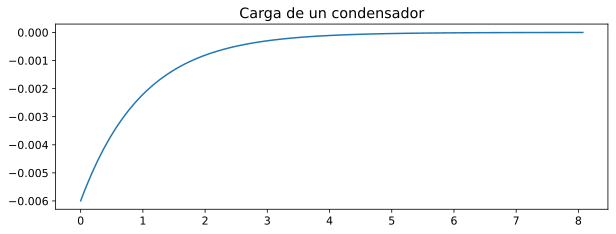


#### **Pregunta:**

   Etiqueta los ejes convenientemente y comenta la gráfica. Dibuja otra
   gráfica con el voltaje en el borne ``V1``. ¿Por qué son *opuestas*?
   ¿Qué le ocurre al voltaje a medida que evoluciona el circuito en el
   tiempo? Dibuja las gráficas en un formato estándar de representación
   vectorial (SVG, por ejemplo). Algo de ayuda
   `aquí <https://ipython.readthedocs.io/en/stable/api/generated/IPython.display.html#IPython.display.set_matplotlib_formats>`__.
   ¿Qué valores devuelve el análisis de tipo ``.op``? Justifícalo.

#### **Respuesta**

#### Dibuja las gráficas en un formato estándar de representación
vectorial (SVG, por ejemplo). Algo de ayuda
`aquí <https://ipython.readthedocs.io/en/stable/api/generated/IPython.display.html#IPython.display.set_matplotlib_formats>`__.

¿Que es SVG?

SVG es un estándar de formato de datos para gráficos vectoriales
escalables, SVG por sus siglas en inglés (*Scalable Vector Graphics*).
El estándar SVG permite definir gráficos mediante texto plano basado en
XML (Extensible Markup Language), lo que lo hace ideal para la web. Una
de sus principales ventajas es que permite definir la imagen mediante
calculo vectorial, lo que se traduce en la capacidad de poder reescalar,
o hacer zoom sobre la imagen sin pérdida de calidad. Esto se consigue
volviendo a renderizar la imagen cuando se hace zoom o se efectúa un
reescalado de esta, adaptando el renderizado a la matriz de resolución
requerida en cada caso, usando la información vectorial que contiene el
archivo. Es decir, cada vez que la imagen cambia de tamaño o forma, se
vuelve a generar el gráfico desde cero para adaptarlo perfectamente a la
resolución den nuevo espacio ocupado. Por lo que nunca encontraremos
efectos de aliasing o dientes de sierra. La imagen se reproducirá tan
perfecta como tu pantalla lo permita.

Para qué **matplotlib** nos muestre los resultados como gráficos
vectoriales escalables, es necesario habilitar el *inline backend* del
formato *svg*. **matplotlib** es compatible con todos estos formatos: \*
**Interactivos**: GTK3Agg, GTK3Cairo, MacOSX, nbAgg, Qt4Agg, Qt4Cairo,
Qt5Agg, Qt5Cairo, TkAgg, TkCairo, WebAgg, WX, WXAgg, WXCairo \*
**Estáticos**: agg, cairo, pdf, pgf, ps, svg, template Para habilitar el
*inline backend* de cualquiera de estos formatos, es posible hacerlo de
este modo:

.. code:: python

   set_matplotlib_formats('svg', …)

Nosotros solo habilitaremos el *inline backend* para SVG.

.. code:: ipython3

    set_matplotlib_formats('svg')

Cuando dibujemos las próximas graficas **matplotlib** las mostrará
usando el backend de svg. Guardaremos alguno de estos resultados en un
archivo con extensión .svg con el fondo transparente y los mostraremos
al final, así se verán genial tanto en temas de color claros como
oscuros.

#### Etiqueta los ejes convenientemente y comenta la gráfica:

Además de etiquetar los ejes, para una mayor claridad, también vamos a
remapear los datos a valores absolutos.

.. code:: ipython3

    plot.rcParams['font.size'] = 12
    plot.rcParams['figure.figsize'] = [4.32*2, 2.28*1.5]
    
    fig, ax = plot.subplots()
    ax.set(xlabel='Tiempo (s)', 
        ylabel='Intensidad (A)', 
        title='Circuito RC serie - ($\mathrm{6v}$) - Resistencia $\mathrm{1\ k\Omega}$ - Condensador $\mathrm{1\ mF}$')
    x = resultados['tran']['T']
    y = resultados['tran']['I(V1)']
    f = lambda x: -x if x < 0 else x
    y = list(map(f, y))
    
    ax.grid()
    line, = ax.plot(x, y)
    line.set_label('Corriente (A)')
    plot.legend()
    plot.tight_layout()
    plot.show()
    # Guardar figura en un archivo vectorial
    fig.savefig(fig_directory + 'fig_current_RC.svg', transparent='true', format='svg')
    fig.savefig(fig_directory_html + 'fig_current_RC.svg', transparent='true', format='svg')


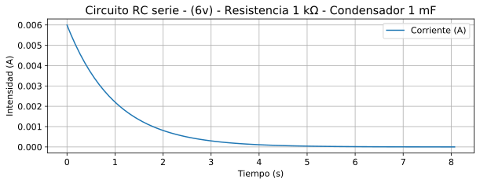


Se aprecia en la gráfica como la corriente inicial es de
:math:`\mathrm{6\ mA}` aproximadamente y disminuye dibujando una curva
que se aproxima asintóticamente a cero.

Como ya hemos comentado anteriormente, los condensadores se oponen a los
cambios bruscos de voltaje. Puesto que se han configurado las
condiciones iniciales del condensador como sin carga, el inicio de la
simulación es equivalente a encender la pila, estando previamente
apagada y el condensador sin carga. Por lo que se da un cambio
instantáneo de potencial en el circuito pasando de :math:`\mathrm{0\ v}`
a :math:`\mathrm{6\ v}`.

Conforme se va cargando el condensador aumenta la impedancia
(*resistencia*) de este, que al estar en serie con una resistencia
(habitualmente llamada limitadora de corriente), la resistencia total
aumenta con el tiempo, y la Ley de Ohm dice que si aumenta la
resistencia la corriente disminuye, y esto es exactamente lo que vemos
en la gráfica.

#### Dibuja otra gráfica con el voltaje en el borne ``V1``. ¿Por qué son
*opuestas*? ¿Qué le ocurre al voltaje a medida que evoluciona el
circuito en el tiempo?

.. code:: ipython3

    plot.rcParams['font.size'] = 12
    plot.rcParams['figure.figsize'] = [4.32*2, 2.28*1.5]
    
    fig, ax = plot.subplots()
    ax.set(xlabel='Tiempo (s)', 
        ylabel='Tensión (V)', 
        title='Circuito RC serie - ($\mathrm{6v}$) - Resistencia $\mathrm{1\ k\Omega}$ - Condensador $\mathrm{1\ mF}$')
    x = resultados['tran']['T']
    y = resultados['tran']['V1']
    f = lambda x: -x if x < 0 else x
    y = list(map(f, y))
    ax.grid()
    ax.plot(x, y)
    plot.tight_layout()
    plot.show()
    # Guardar figura en un archivo vectorial
    fig.savefig(fig_directory + 'fig_volt_RC.svg', transparent='true', format='svg')
    fig.savefig(fig_directory_html + 'fig_volt_RC.svg', transparent='true', format='svg')


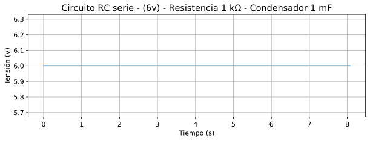


Las gráficas no son *opuestas*, y no deben serlo, puesto que ``V1`` es
la salida de la pila, que en condiciones ideales es capaz de suministrar
la corriente demandada y el voltaje se mantiene constante.

¿Como es esto posible? ¿Como puede variar la corriente y mantenerse la
tensión constante? El motivo, es que la diferencia de potencial varía
entre los extremos de la resistencia, pero no entre los extremos del
circuito. Es decir, varia el voltaje entre los nodos 1 y 2 y entre los
nodos 2 y 0, pero no entre los nodos 1 y 0, que es lo que la gráfica
está mostrando.

Dibujemos las gráficas del voltaje de la resistencia y del condensador
para ver esto más claro. Y porque probablemente es a esto a lo que la
pregunta se refiere.

.. code:: ipython3

    plot.rcParams['font.size'] = 12
    plot.rcParams['figure.figsize'] = [4.32*2, 2.28*2]
    
    fig, ax = plot.subplots()
    tiempo = resultados['tran']['T']
    v1 = resultados['tran']['V1']
    v_C1 = resultados['tran']['V2']
    f = lambda a,b: a - b
    v_R1 = list(map(f, v1, v_C1))
    
    line_C1, = ax.plot(tiempo, v_C1)
    line_C1.set_label('Voltaje extremos C1')
    
    ax.set(xlabel='Tiempo (s)', 
        ylabel='Tensión (V)', 
        title='Circuito RC serie - ($\mathrm{6v}$) - Resistencia $\mathrm{1\ k\Omega}$ - Condensador $\mathrm{1\ mF}$')
    
    plot.legend()
    plot.grid()
    plot.tight_layout()
    fig.savefig(fig_directory + 'fig_volts_c1_RC.svg', transparent='true', format='svg')
    fig.savefig(fig_directory_html + 'fig_volts_c1_RC.svg', transparent='true', format='svg')
    
    line_R1, = ax.plot(tiempo, v_R1)
    line_R1.set_label('Voltaje extremos R1')
    
    plot.legend()
    plot.tight_layout()
    # Guardar figura en un archivo vectorial
    fig.savefig(fig_directory + 'fig_volts_r1_&_c1_RC.svg', transparent='true', format='svg')
    fig.savefig(fig_directory_html + 'fig_volts_r1_&_c1_RC.svg', transparent='true', format='svg')
    plot.show()


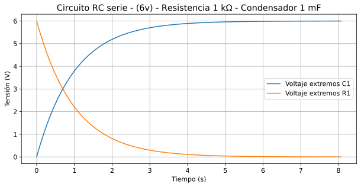


Aunque las gráficas del voltaje en los extremos de la resistencia y del
condensador también son *opuestas*, no es esto lo que pregunta el
enunciado. La comparación la debemos realizar entre la curva del voltaje
del condensador y la curva de la corriente.

|image1|

|image2|

El motivo por el que son opuestas, es porque de lo contrario no se
cumpliría la Ley de Ohm (:math:`\mathrm{V = R \cdot I}`). Si
:math:`\mathrm{R}` es constante, y cambia :math:`\mathrm{I}`, a la
fuerza, tiene que cambiar :math:`\mathrm{V}`. Pero la clave para
comprenderlo está más bien en la resistencia *“limitadora de
corriente”*, la cual, podemos estar seguros, tiene una resistencia
constante.

¿Qué es lo que sucede? Puesto que ``R1`` tiene una resistencia constante
y ``C1`` se opone a los cambios bruscos de tensión. A lo largo del
tiempo cambia el voltaje que ocupa ``C1``, y puesto que se debe de
cumplir la Ley de Kirchhoff, al mantenerse constante el suministro de la
pila, la suma de las tensiones de la resistencia y el condensador deben
de sumar el voltaje de fuente. Esto hace que, por la Ley de Ohm, el
voltaje en la resistencia también varíe (como se ve en su gráfica), al
ser su resistencia constante provoca que varíe la corriente.

¿Por qué he llamado a la resistencia *“limitadora de corriente”*?

No sería absurdo plantearse la siguiente cuestión. Si, la resistencia de
``R1`` es constante, el voltaje de la fuentes es constante, pero la
corriente cambia en el tiempo, ¿Qué está pasando?, acaso, ¿el
condensador tiene resistencia?, es más, ¿acaso la resistencia del
condensador varía? Pues sí, además no pude ser de otro modo, no existe
otra explicación que cumpla la Ley de Ohm. Pero no, en realidad los
condensadores no tienen resistencia, o no exactamente, sino que la
magnitud en la que se oponen al flujo de electrones está estrechamente
ligada a la diferencia de potencial entre sus extremos. Es decir, cuando
está ausente de carga (no hay diferencia de potencial en sus extremos)
su resistencia, o mejor, llamémoslo por su nombre, su **impedancia** es
:math:`\mathrm{0\ \Omega}`.

Para, para, para…, ¿cómo cero?, entonces, si su resistencia es 0, o
mejor dicho, si su **impedancia** es 0. Si le aplicamos voltaje, según
la Ley de Ohm…

.. math:: \mathrm{V=R\cdot I\ \rightarrow}\ I=\frac{\mathrm{V}}{\mathrm{R}}\mathrm{\ \rightarrow}\ I=\frac{\mathrm{V} }{\mathrm{0}}=\infty  

¿Es esto posible? Pues sí, así es, la corriente se iría a infinito. Esto
es lo que en electrónica llamamos un *cortocircuito*. Por suerte, esto
solo dura un instante, y aunque la fuente fuera capaz de suministrar tal
cantidad de corriente (que no lo es), en cuanto el condensador empieza a
cargarse, su impedancia aumenta rápidamente, y por suerte no agota todos
los recursos energéticos que nos quedan. Este es el motivo por el que,
en electrónica, a la resistencia que a menudo acompaña en serie al
condensador, la llamamos *“limitadora de corriente”*, ya que garantiza
que siempre haya una mínima resistencia y evite que el flujo de
corriente sea infinito, y nos quedemos sin energía. Aunque hay alguna
que otra posibilidad de que algo explote o se queme y nos libre de
agotar la energía.

.. |image1| image:: https://raw.githubusercontent.com/tikissmikiss/Laboratorio-LTspice/master/resource/figures/fig_current_RC.svg?sanitize=true
.. |image2| image:: https://raw.githubusercontent.com/tikissmikiss/Laboratorio-LTspice/master/resource/figures/fig_volts_c1_RC.svg?sanitize=true

Cuando hemos dibujado las gráficas más arriba, las hemos guardado cada
una en un archivo de gráficos vectoriales escalables o SVG.

#### ¡Veamos qué tal se ven!

#### \* Relación Corriente-Tiempo en un circuito RC serie
(.:raw-latex:`\figuras`:raw-latex:`\fig`\_current_RC.svg) |Gráfico
vectorial escalable - Relación Corriente-Tiempo en un circuito RC serie|

#### \* Relación Voltios-Tiempo para la resistencia y el condensador de
un circuito RC serie (./figuras/fig_volts_r1_&_c1_RC.svg) |Gráfico
vectorial escalable - Relación Voltios-Tiempo para la resistencia y el
condensador de un circuito RC serie|

#### \* Relación Voltios-Tiempo en V1 (./figuras/fig_volt_RC.svg)
|image1|

#### \* Relación Voltios-Tiempo en el condensador de un circuito RC
serie (./figuras/fig_volts_c1_RC.svg) |image2|

.. |Gráfico vectorial escalable - Relación Corriente-Tiempo en un circuito RC serie| image:: .\figuras\fig_current_RC.svg?sanitize=true
.. |Gráfico vectorial escalable - Relación Voltios-Tiempo para la resistencia y el condensador de un circuito RC serie| image:: ./figuras/fig_volts_r1_&_c1_RC.svg?sanitize=true
.. |image1| image:: ./figuras/fig_volt_RC.svg?sanitize=true
.. |image2| image:: ./figuras/fig_volts_c1_RC.svg?sanitize=true

#### ¿Qué valores devuelve el análisis de tipo ``.op``?

El análisis ``.op`` devuelve lo siguiente:

.. code:: ipython3

    print(resultados['op'])


.. parsed-literal::

    OP simulation results for '* carga condensador'(netlist files\condensador_en_continua.ckt).
    Run on 2021-01-02 19:45:06, data file None.
    Variable    Units      Value    Error    %
    ----------  -------  -------  -------  ---
    V1          V              6   -6e-12    0
    V2          V              6   -6e-12    0
    I(V1)       A              0    0        0
    

Está mostrando la situación del circuito tras haberse estabilizado
después de aplicar la tensión. Esto es con el condensador en su máxima
carga posibles para el potencial suministrado.

Como podemos ver arriba, la curva de la carga del condensador se pega
asintóticamente a :math:`\mathrm{6\ v}`. Y la curva de la corriente se
pega asintóticamente a :math:`\mathrm{0\ A}`. Y esto solo puede suceder
porque la impedancia del condensador ha aumentado hasta el punto de ser
tan elevada que casi se interrumpe el flujo eléctrico, aunque esto nunca
llega a suceder.

## Carrera de condensadores

Ahora tenemos un circuito con dos condensadores en paralelo:

|image1|

#### **Pregunta:**

   Crea el netlist de este circuito e identifica qué condensador se
   satura primero. Dibuja la evolución de la intensidad en ambas ramas
   de manera simultánea.
   `Aquí <https://matplotlib.org/gallery/api/two_scales.html>`__ tienes
   un ejemplo de cómo se hace esto en Matplotlib. Recuerda que para que
   Ahkab nos devuelva la corriente en una rama, debe de estar presente
   una pila. Si es necesario, inserta pilas virtuales de valor nulo
   (cero voltios), tal y como hemos comentado antes. Grafica también los
   voltajes (en otra gráfica, pero que aparezcan juntos).

.. |image1| image:: https://raw.githubusercontent.com/pammacdotnet/spicelab/master/condensadores%20en%20paralelo.svg?sanitize=true

#### **Respuesta:**

Ambos se cargarán al mismo tiempo, debido a que están en paralelo entre
sí y en serie con una resistencia común, lo que va a provocar que ambas
tenga la misma tensión.# %%

.. code:: ipython3

    %%writefile "files\carrera_de_condensadores.ckt"
    * Carga condensador
    v0 1 0 type=vdc vdc=10
    r1 0 2 3.3k
    c1 2 3 47u ic=0
    v1dummy 3 1 type=vdc vdc=0
    c2 2 4 22u ic=0
    v2dummy 4 1 type=vdc vdc=0
    .tran tstep=0.01 tstart=6.5 tstop=9 uic=0
    .end


.. parsed-literal::

    Writing files\carrera_de_condensadores.ckt
    

### Procesamos el circuito con ``Ahkab`` y extraemos los datos.

.. code:: ipython3

    # Procesar circuito
    circuito_y_análisis = ahkab.netlist_parser.parse_circuit("files\carrera_de_condensadores.ckt")
    # Separar datos netlist y simulaciones
    netlist = circuito_y_análisis[0]
    análisis_en_netlist = circuito_y_análisis[1]
    # Extraer datos de simulaciones
    lista_de_análisis = ahkab.netlist_parser.parse_analysis(netlist, análisis_en_netlist)
    # Establecer condiciones óptimas para los análisis `.dc` y/o `.tran` si lo hay.
    for análisis in [d for i, d in enumerate(lista_de_análisis) if "dc" in d.values() or "tran" in d.values()]:
        análisis['outfile'] = files_directory + "simulación_" + análisis['type'] + ".tsv"

Ejecutamos la simulación

.. code:: ipython3

    resultados = ahkab.run(netlist, lista_de_análisis)


.. parsed-literal::

    Starting transient analysis: 
    Selected method: TRAP
    Solving...  done.
    Average time step: 0.00961538
    

.. code:: ipython3

    plot.rcParams['font.size'] = 12
    plot.rcParams['figure.figsize'] = [4.32*2.6, 2.28*2]
    
    figura, ax = plt.subplots()
    plt.title("Carrera de condensadores")
    ax.set(xlabel='Tiempo (s)', ylabel='Corriente (A)')
    plt.xlim(6.5*0.99, 9*1.01)
    plt.ylim(-0.0001, 0.002)
    plt.grid()
    plt.plot(list(map(lambda x: -x if x < 0 else x, resultados['tran']['T'])), 
        list(map(lambda x: -x if x < 0 else x, resultados['tran']['I(V1DUMMY)'])), 
        label="Intensidad en C1")
    plt.plot(list(map(lambda x: -x if x < 0 else x, resultados['tran']['T'])), 
        list(map(lambda x: -x if x < 0 else x, resultados['tran']['I(V2DUMMY)'])), 
        label="Intensidad en C2")


.. parsed-literal::

    [<matplotlib.lines.Line2D at 0x24af6fe7408>]


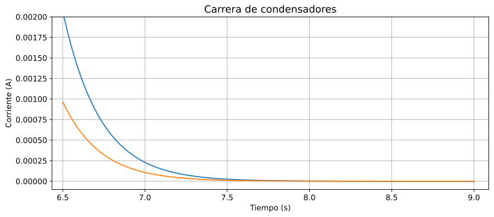


.. code:: ipython3

    tiempo = resultados['tran']['T']
    f = lambda x: -x if x < 0 else x
    i_C1 = resultados['tran']['I(V1DUMMY)']
    i_C1 = list(map(f, i_C1))
    i_C2 = resultados['tran']['I(V2DUMMY)']
    i_C2 = list(map(f, i_C2))
    i_R1 = resultados['tran']['I(V0)']
    i_R1 = list(map(f, i_R1))
    
    plot.rcParams['font.size'] = 12
    plot.rcParams['figure.figsize'] = [4.32*2.3, 2.28*2]
    
    fig, ax = plot.subplots()
    plot.title('Circuito carrera condensadores - ($\mathrm{10v}$) - C1:$\mathrm{47\mu\Omega}$ - C2:$\mathrm{22\mu\Omega}$')
    ax.set(xlabel='Tiempo (s)', ylabel='Corriente (A)')
    line_iC1, = ax.plot(tiempo, i_C1)
    line_iC2, = ax.plot(tiempo, i_C2)
    line_iR1, = ax.plot(tiempo, i_R1)
    line_iC1.set_label('Corriente C1')
    line_iC2.set_label('Corriente C2')
    line_iR1.set_label('Corriente R1')
    plot.legend()
    plot.grid(True)
    plot.tight_layout()
    plot.show()


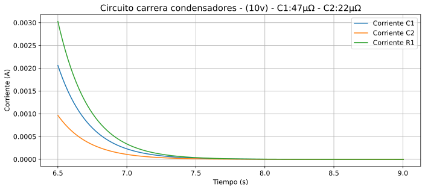


Se puede observar la corriente de ambos condensadores y la de la
resistencia, que es la misma que la total del circuito, aunque su bajada
es diferente, se acercan a cero prácticamente a la vez.

.. code:: ipython3

    tiempo = resultados['tran']['T']
    v_R1 = resultados['tran']['V2']
    v_C1 = resultados['tran']['V3']
    v_C2 = resultados['tran']['V4']
    f = lambda a, b: a - b
    v_C1 = list(map(f, v_C1, v_R1))
    v_C2 = list(map(f, v_C2, v_R1))
    
    plot.rcParams['font.size'] = 12
    plot.rcParams['figure.figsize'] = [4.32*2.3, 2.28*2]
    
    fig, ax = plot.subplots()
    plot.title('Circuito carrera condensadores - ($\mathrm{10v}$) - C1:$\mathrm{47\mu\Omega}$ - C2:$\mathrm{22\mu\Omega}$')
    ax.set(xlabel='Tiempo (s)', ylabel='Voltios (V)')
    ax.grid(True)
    
    line_vC1, = ax.plot(tiempo, v_C1)
    line_vR1, = ax.plot(tiempo, v_R1)
    line_vC2, = ax.plot(tiempo, v_C2)
    line_vR1, = ax.plot(tiempo, v_R1)
    line_vC1.set_label('Voltios C1')
    line_vC1.set_c('tab:blue')
    line_vR1.set_label('Voltios R1')
    line_vR1.set_c('tab:red')
    line_vC2.set_label('Voltios C2')
    line_vC2.set_c('tab:green')
    line_vR1.set_label('Voltios R1')
    line_vR1.set_c('tab:red')
    
    plot.legend()
    plot.tight_layout()


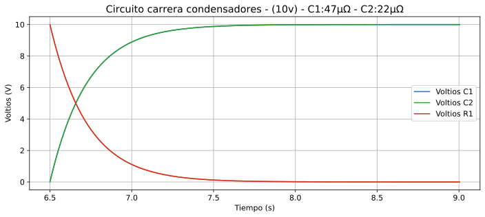


Puesto que el voltaje de la fuente no cambia, se reparten la diferencia
de potencial entre la resistencia y los dos condensadores.

#### Todas juntas.

.. code:: ipython3

    plot.rcParams['font.size'] = 12
    plot.rcParams['figure.figsize'] = [4.32*2.3, 2.28*2]
    
    fig, ax1 = plot.subplots()
    ax2 = ax1.twinx()  
    plot.title('Circuito carrera condensadores - ($\mathrm{10v}$) - C1:$\mathrm{47\mu\Omega}$ - C2:$\mathrm{22\mu\Omega}$') 
    ax1.set_xlabel('Tiempo (s)') 
    ax1.set_ylabel('Corriente (A)')
    ax2.set_ylabel('Voltios (V)')
    ax1.tick_params(axis='y')
    ax2.tick_params(axis='y')
    ax1.grid(True)
    line_iC1, = ax1.plot(tiempo, i_C1)
    line_iC2, = ax1.plot(tiempo, i_C2)
    line_iR1, = ax1.plot(tiempo, i_R1)
    line_vC1, = ax2.plot(tiempo, v_C1)
    line_vC2, = ax2.plot(tiempo, v_C2)
    line_vR1, = ax2.plot(tiempo, v_R1)
    line_iC1.set_c('tab:blue')
    line_iC2.set_c('tab:orange')
    line_iR1.set_c('tab:green')
    line_vC1.set_c('tab:cyan')
    line_vC2.set_c('tab:purple')
    line_vR1.set_c('tab:red')
    
    plot.legend(
        (line_iC1, line_iC2, line_iR1, line_vC1, line_vC2, line_vR1, ), 
        ("Corriente C1", "Corriente C2", "Corriente R1", "Voltios C1", "Voltios C2", "Voltios R1"))
    fig.tight_layout()  
    plt.show()


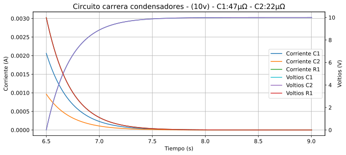


### **Ejercicio premium:**

Repite la simulación con LTspice (invocándolo como comando externo,
leyendo los datos de un fichero ``.raw`` y volviendo a graficar con
Matplotlib.

### Resolución del mismo circuito con LTspice

Vamos a adaptar el netlist para que sea compatible con LTspice.

El efecto de la configuración del análisis ``.tran`` difiere bastante
entre LTspice y Ahkab. En Ahkab tenemos puesto:
``Ahkab  .tran tstep=0.01 tstart=6.5 tstop=7.5 uic=0`` Esta
configuración mantiene el circuito en reposo hasta que se alcanza
``tstart`` (6.5 seg.). Un instante antes se activa la pila y en el
instante siguiente se inicia al mismo tiempo la simulación y las
mediciones del análisis.

La expresión equivalente en LTspice sería la siguiente:
``LTspice  .tran 0.01 7.5 6.5 uic`` Pero el efecto que tiene es
totalmente diferente. En este caso LTspice, inicia la simulación en el
instante 0, pero no comienza a tomar medidas hasta los 6.5 seg. y deja
de tomar medias 1 seg. después de la primera medición. Por lo que para
cuando se empieza muestrear la señal los condensadores ya están
cargados.

Para simular un escenario similar al de la simulación con ``Ahkab``,
usaremos la opción PWL que permite establecer un voltaje concreto en el
instante deseado.

#### ¿Como funciona PWL?

:math:`\mathrm{PWL([T_1\ V_1]\ [T_2\ V_3]\ ...\ [T_n\ V_n]\ )}`

Se ponen números separados por espacios, que están relacionados por
parejas, de modo que las posiciones impares representan un instante en
el tiempo, y las posiciones pares el voltaje al que se pondrá la pila en
ese instante.

Nuestra configuración va a estar construida por la combinación de PWL
con el análisis ``.tran``.

-  PWL: Esta configuración mantendrá la pila sin tensión hasta los 6.5
   segundos, y en la décima de segundo siguiente se pondrá a 10 v.

``PWL(6.5 0 6.51 10)``

-  .tran: Esta configuración afectara de modo que, no se van a realizar
   mediciones hasta una décima de segundo antes de que se active la
   pila, y tomará medias cada décima de segundo hasta el segundo 8.

``.tran 0 8 6.4 0.01 uic``

.. code:: ipython3

    %%writefile "files\carrera_de_condensadores.net"
    * Carga condensador
    v0 1 0 PWL(6.5 0 6.51 10)
    r1 2 0 3.3k
    c1 1 2 47u
    c2 1 2 22u 
    .tran 0 8 6.4 0.01 uic
    .end


.. parsed-literal::

    Writing files\carrera_de_condensadores.net
    

Ejecutamos LTspice pasando al ejecutable el archivo que acabamos de
crear como parámetro.

.. code:: ipython3

    # lts "files\carrera_de_condensadores.net"
    if platform.system() == "Darwin":
        get_ipython().system('/Applications/LTspice.app/Contents/MacOS/LTspice -ascii -b files/carrera_de_condensadores.net')
    if platform.system() == "Windows":
        get_ipython().system('"C:\\Program Files\\LTC\\LTspiceXVII\\XVIIx64.exe" -ascii -b files\\carrera_de_condensadores.net')

Veamos el contenido del archivo, ``.log``.

## Contenido del ``.log``:

.. code:: ipython3

    get_ipython().run_line_magic('pycat', 'files\carrera_de_condensadores.log')

Ahora extraemos los datos del archivo ``.raw``.

.. code:: ipython3

    l = ltspice.Ltspice("files\carrera_de_condensadores.raw")
    l.parse()
    
    tiempo = l.get_time()
    i_C1 = l.get_data('I(C1)')
    i_C2 = l.get_data('I(C2)')
    i_R1 = l.get_data('I(R1)')
    v_R1 = l.get_data('V(2)')
    vcc = l.get_data('V(1)')
    v_Cs = l.get_data('V(1)')
    f = lambda a, b: a - b
    v_Cs = list(map(f, v_Cs, v_R1))

Dibujamos las gráficas con los datos obtenidos con LTspice.

.. code:: ipython3

    plot.rcParams['font.size'] = 12
    plot.rcParams['figure.figsize'] = [4.32*2.3, 2.28*2]
    
    fig, ax = plot.subplots()
    plot.title('Corrientes circuito carrera condensadores - ($\mathrm{10v}$) - C1:$\mathrm{47\mu\Omega}$ - C2:$\mathrm{22\mu\Omega}$')
    ax.set(xlabel='Tiempo (s)', ylabel='Corriente (A)')
    
    line_iC1, = ax.plot(tiempo, i_C1)
    line_iC1.set_label('Corriente C1')
    
    line_iC2, = ax.plot(tiempo, i_C2)
    line_iC2.set_label('Corriente C2')
    
    line_iR1, = ax.plot(tiempo, i_R1)
    line_iR1.set_label('Corriente R1')
    
    plot.legend()
    plot.grid(True)
    plot.tight_layout()
    plot.show()


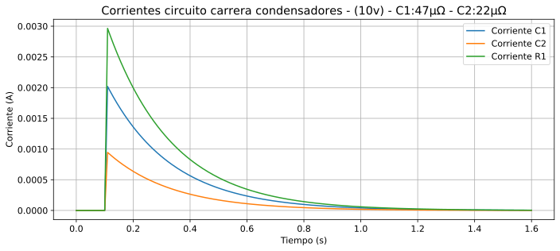


.. code:: ipython3

    plot.rcParams['font.size'] = 12
    plot.rcParams['figure.figsize'] = [4.32*2.3, 2.28*2]
    
    fig, ax = plot.subplots()
    plot.title('Voltajes circuito carrera condensadores - ($\mathrm{10v}$) - C1:$\mathrm{47\mu\Omega}$ - C2:$\mathrm{22\mu\Omega}$')
    ax.set(xlabel='Tiempo (s)', ylabel='Voltios (V)')
    
    line_vC2, = ax.plot(tiempo, v_Cs)
    line_vC2.set_label('Voltios C1 y C2')
    line_vC2.set_c('tab:green')
    
    line_vR1, = ax.plot(tiempo, v_R1)
    line_vR1.set_label('Voltios R1')
    line_vR1.set_c('tab:red')
    
    line_vC1, = ax.plot(tiempo, vcc)
    line_vC1.set_label('Voltios VCC')
    line_vC1.set_c('tab:blue')
    
    ax.grid(True)
    plot.legend()
    plot.tight_layout()
    # plt.savefig("test.svg", format="svg")
    # plot.rcParams['figure.figsize'] = [6.4*1.9, 4.8]
    # plot.rcParams['font.size'] = 12
    
    # {'tab:blue', 'tab:orange', 'tab:green', 'tab:red', 'tab:purple', 'tab:brown', 'tab:pink', 'tab:gray', 'tab:olive', 'tab:cyan'}


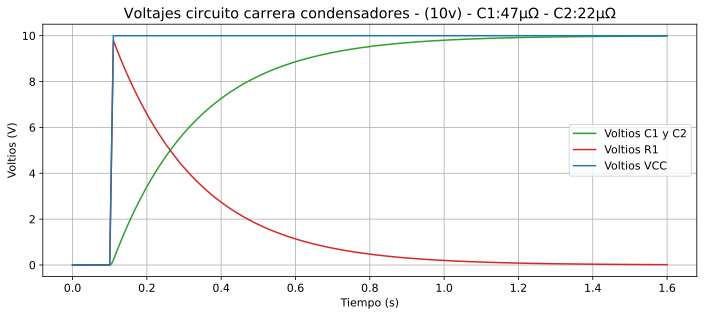


## Circuitos en corriente alterna

### \*\* Ejercicio:*\*

Simula este circuito con LTspice y representa el voltaje y la intensidad
en función del tiempo. Traduce este ejercicio a la versión Spice de
Akhab y haz la misma representación. Ahkab utiliza otra sintaxis para
expresar la corriente alterna. Esta está descrita en la
`documentación <https://ahkab.readthedocs.io/en/latest/help/Netlist-Syntax.html#id24>`__.
``* Circuito en corriente alterna  v1 1 0 sin(0 120 60 0 0)  r1 0 1 10k  .tran 1  .end``

### \*\* Solución:*\*

|image1|

Se simula un circuito de corriente alterna usando un generador de onda
sinusoidal configurado con un voltaje de pico de
:math:`\mathrm{120\ v}`, es decir, :math:`V_{pp}=\mathrm{240\ v}`, y una
frecuencia de :math:`\mathrm{60\ Hz}`, conectado a una carga de
:math:`\mathrm{10\ k\Omega}`

.. |image1| image:: https://raw.githubusercontent.com/tikissmikiss/Laboratorio-LTspice/master/resource/Circuito_alterna_lab_fisica.svg?sanitize=true

.. code:: ipython3

    %%writefile "files\corriente_alterna.net"
    * Circuito en corriente alterna
    v1 1 0 sin(0 120 60 0 0)
    r1 0 1 10k
    .tran 1
    .end


.. parsed-literal::

    Writing files\corriente_alterna.net
    

Ejecutamos LTspice con el netlist como parámetro para generar los
archivos ``.log`` y ``.raw``.

.. code:: ipython3

    # lts "files\corriente_alterna.net"
    if platform.system() == "Darwin":
        get_ipython().system('/Applications/LTspice.app/Contents/MacOS/LTspice -ascii -b files/corriente_alterna.net')
    if platform.system() == "Windows":
        get_ipython().system('"C:\\Program Files\\LTC\\LTspiceXVII\\XVIIx64.exe" -ascii -b files\\corriente_alterna.net')

Ahora extraemos los datos relativos al tiempo, la corriente y tensión
del archivo ``.raw`` y los almacenamos en vectores diferentes.

.. code:: ipython3

    l = ltspice.Ltspice("files\corriente_alterna.raw")
    l.parse()
    
    tiempo = l.get_time()
    vac = l.get_data('V(1)')
    i_R1 = l.get_data('I(R1)')
    nSvg=0

Representamos los datos obtenidos con LTspice en una misma gráfica.

.. code:: ipython3

    plot.rcParams['font.size'] = 12
    plot.rcParams['figure.figsize'] = [4.32*3, 2.28*2]
    
    rojo='tab:red'
    verde='tab:green'
    
    fig, ax_V = plot.subplots()
    plot.title('Circuito Corriente Alterna - ($\mathrm{10v}$) - VAC:$\mathrm{120v}$-$\mathrm{60Hz}$ R:$\mathrm{10k\Omega}$ - LTspice')
    ax_I = ax_V.twinx()  
    
    ax_V.tick_params(axis='y', labelcolor=verde)
    ax_I.tick_params(axis='y', labelcolor=rojo)
    
    ax_V.set_xlabel('Tiempo (s)')
    ax_V.set_ylabel('Voltaje (V)', color=verde)
    ax_I.set_ylabel('Corriente (A)', color=rojo)
    
    line_V, = ax_V.plot(tiempo, vac)
    line_V.set_label('Corriente R1')
    line_V.set_c(verde)
    
    line_I, = ax_I.plot(tiempo, i_R1)
    line_I.set_label('Voltaje VAC')
    line_I.set_c(rojo)
    
    plot.grid(True)
    plot.tight_layout()
    nSvg += 1
    fig.savefig(fig_directory + 'alterna' + str(nSvg) + '.svg', transparent='true', format='svg')
    fig.savefig(fig_directory_html + 'alterna' + str(nSvg) + '.svg', transparent='true', format='svg')


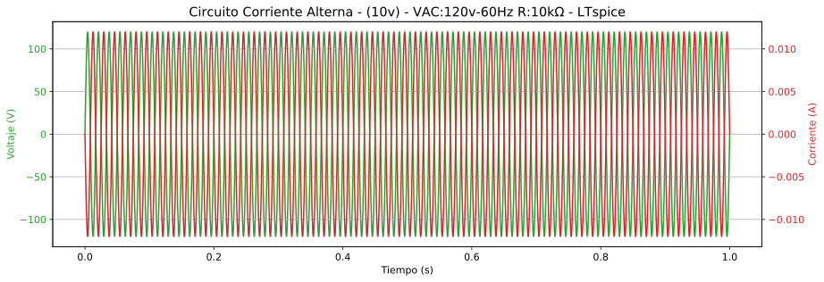


Hemos representado la señal en el transcurso de 1 segundo y es difícil
de apreciar la señal con claridad. Vamos a representar usando el mismo
espacio, tres ciclos completos. Puesto que la onda generada es de
:math:`\mathrm{60\ Hz}`, tenemos que captura tres veces la sexagésima
parte de un segundo, es decir, :math:`\mathrm{\frac{1}{20}\ s}`.

.. code:: ipython3

    plot.rcParams['font.size'] = 12
    plot.rcParams['figure.figsize'] = [4.32*3, 2.28*2]
    
    rojo='tab:red'
    verde='tab:green'
    
    fig, ax_V = plot.subplots()
    ax_V.set_xlim(0, 1/20)
    plot.title('Circuito Corriente Alterna - ($\mathrm{10v}$) - VAC:$\mathrm{120v}$-$\mathrm{60Hz}$ R:$\mathrm{10k\Omega}$ - LTspice')
    ax_I = ax_V.twinx()  
    
    ax_V.tick_params(axis='y', labelcolor=verde)
    ax_I.tick_params(axis='y', labelcolor=rojo)
    
    ax_V.set_xlabel('Tiempo (s)')
    ax_V.set_ylabel('Voltaje (V)', color=verde)
    ax_I.set_ylabel('Corriente (A)', color=rojo)
    
    line_V, = ax_V.plot(tiempo, vac)
    line_V.set_label('Corriente R1')
    line_V.set_c(verde)
    
    line_I, = ax_I.plot(tiempo, i_R1)
    line_I.set_label('Voltaje VAC')
    line_I.set_c(rojo)
    
    plot.grid(True)
    plot.tight_layout()
    nSvg += 1
    fig.savefig(fig_directory + 'alterna' + str(nSvg) + '.svg', transparent='true', format='svg')
    fig.savefig(fig_directory_html + 'alterna' + str(nSvg) + '.svg', transparent='true', format='svg')


Vaya,… Parece que se ha perdido algo de calidad en la representación y
la onda no se ve todo lo suavizada que debería. Esto es debido a que
hemos pedido a LTspice que muestre la señal durante un segundo, por lo
que ha adaptado el sampling rate a ese tiempo. Ahora, al dibujar solo
0.05 segundos, el número de muestras contenidas en ese tiempo es
relativamente bajo, y por eso podemos apreciar en el gráfico vectorial
los vectores rectos que dibujan la curva, apreciándose los vértices
donde confluyen dos vectores.

Aunque la calidad es podría ser suficiente para analizar el resultado,
estamos por aprender, así que vamos a volver a repetir la simulación
pero esta vez le pediremos a LTspice que concentre todas las muestras en
0.05 segundos.

Veamos el resultado.

.. code:: ipython3

    %%writefile "files\corriente_alterna.net"
    * Circuito en corriente alterna
    v1 1 0 sin(0 120 60 0 0)
    r1 0 1 10k
    .tran 0.05
    .end


.. parsed-literal::

    Overwriting files\corriente_alterna.net
    

.. code:: ipython3

    # lts "files\corriente_alterna.net"
    if platform.system() == "Darwin":
        get_ipython().system('/Applications/LTspice.app/Contents/MacOS/LTspice -ascii -b files/corriente_alterna.net')
    if platform.system() == "Windows":
        get_ipython().system('"C:\\Program Files\\LTC\\LTspiceXVII\\XVIIx64.exe" -ascii -b files\\corriente_alterna.net')
    
    l = ltspice.Ltspice("files\corriente_alterna.raw")
    l.parse()
    
    tiempo = l.get_time()
    vac = l.get_data('V(1)')
    i_R1 = l.get_data('I(R1)')
    
    rojo='tab:red'
    verde='tab:green'
    
    plot.rcParams['font.size'] = 12
    plot.rcParams['figure.figsize'] = [4.32*3, 2.28*2]
    
    fig, ax_V = plot.subplots()
    ax_V.set_xlim(0, 1/20)
    plot.title('Circuito Corriente Alterna - ($\mathrm{10v}$) - VAC:$\mathrm{120v}$-$\mathrm{60Hz}$ R:$\mathrm{10k\Omega}$ - LTspice')
    ax_I = ax_V.twinx()  
    
    ax_V.tick_params(axis='y', labelcolor=verde)
    ax_I.tick_params(axis='y', labelcolor=rojo)
    
    ax_V.set_xlabel('Tiempo (s)')
    ax_V.set_ylabel('Voltaje (V)', color=verde)
    ax_I.set_ylabel('Corriente (A)', color=rojo)
    
    line_V, = ax_V.plot(tiempo, vac)
    line_V.set_label('Corriente R1')
    line_V.set_c(verde)
    
    line_I, = ax_I.plot(tiempo, i_R1)
    line_I.set_label('Voltaje VAC')
    line_I.set_c(rojo)
    
    # plot.legend()
    plot.grid(True)
    plot.tight_layout()
    nSvg += 1
    fig.savefig(fig_directory + 'alterna' + str(nSvg) + '.svg', transparent='true', format='svg')
    fig.savefig(fig_directory_html + 'alterna' + str(nSvg) + '.svg', transparent='true', format='svg')


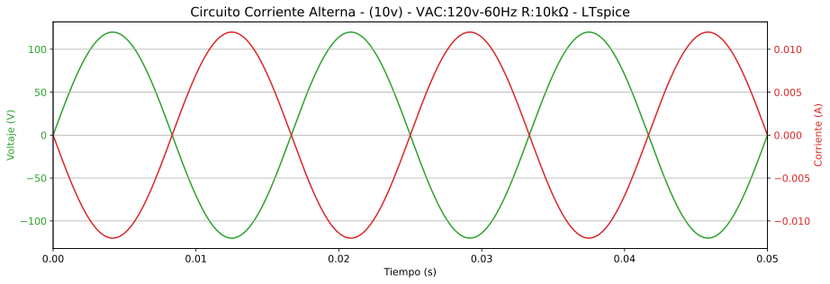


Ahora sí, otra cosa es esto. Como podemos apreciar en la gráfica, el
voltaje y la corriente evolucionan con una proporcionalidad inversa de
10000:1, justamente el número de ohmios que tiene una resistencia de
:math:`\mathrm{10\ k\Omega}` como la de nuestro circuito. ¿Qué porqué
coincide?, pues por la Ley de Ohm, para :math:`\mathrm{10\ k\Omega}`
hacen falta :math:`\mathrm{10\ kV}` para tener :math:`\mathrm{1\ A}`.

### Ahora realicemos la simulación con Ahkab Lo primero es adaptar el
netlist

.. code:: ipython3

    %%writefile "files\corriente_alterna.ckt"
    * Circuito alterna
    V1 1 0 type=sin vo=0 va=120 freq=60
    R1 0 1 10k
    .tran tstep=0.0001 tstart=0 tstop=0.05
    .end


.. parsed-literal::

    Writing files\corriente_alterna.ckt
    

### Procesamos el circuito con ``Ahkab`` y extraemos los datos.

.. code:: ipython3

    # Procesar circuito
    circuito_y_análisis = ahkab.netlist_parser.parse_circuit("files\corriente_alterna.ckt")
    # Separar datos netlist y simulaciones
    netlist = circuito_y_análisis[0]
    análisis_en_netlist = circuito_y_análisis[1]
    # Extraer datos de simulaciones
    lista_de_análisis = ahkab.netlist_parser.parse_analysis(netlist, análisis_en_netlist)
    # Establecer condiciones óptimas para los análisis `.dc` y/o `.tran` si lo hay.
    for análisis in [d for i, d in enumerate(lista_de_análisis) if "dc" in d.values() or "tran" in d.values()]:
        análisis['outfile'] = files_directory + "simulación_" + análisis['type'] + ".tsv"

#### Ejecutamos la simulación

.. code:: ipython3

    resultados = ahkab.run(netlist, lista_de_análisis)


.. parsed-literal::

    Starting transient analysis: 
    Selected method: TRAP
    Solving...  done.
    Average time step: 9.86193e-05
    

.. code:: ipython3

    tiempo = resultados['tran']['T']
    vac = resultados['tran']['V1']
    i_R1 = resultados['tran']['I(V1)']
    
    rojo='tab:red'
    verde='tab:green'
    
    plot.rcParams['font.size'] = 12
    plot.rcParams['figure.figsize'] = [4.32*3, 2.28*2]
    
    fig, ax_V = plot.subplots()
    plot.title('Circuito Corriente Alterna - ($\mathrm{10v}$) - VAC:$\mathrm{120v}$-$\mathrm{60Hz}$ R:$\mathrm{10k\Omega}$ - Ahkab')
    ax_I = ax_V.twinx()  
    
    ax_V.tick_params(axis='y', labelcolor=verde)
    ax_I.tick_params(axis='y', labelcolor=rojo)
    
    ax_V.set_xlabel('Tiempo (s)')
    ax_V.set_ylabel('Voltaje (V)', color=verde)
    ax_I.set_ylabel('Corriente (A)', color=rojo)
    
    line_V, = ax_V.plot(tiempo, vac)
    line_V.set_label('Corriente R1')
    line_V.set_c(verde)
    
    line_I, = ax_I.plot(tiempo, i_R1)
    line_I.set_label('Voltaje VAC')
    line_I.set_c(rojo)
    
    plot.grid(True)
    plot.tight_layout()
    nSvg += 1
    fig.savefig(fig_directory + 'alterna' + str(nSvg) + '.svg', transparent='true', format='svg')
    fig.savefig(fig_directory_html + 'alterna' + str(nSvg) + '.svg', transparent='true', format='svg')


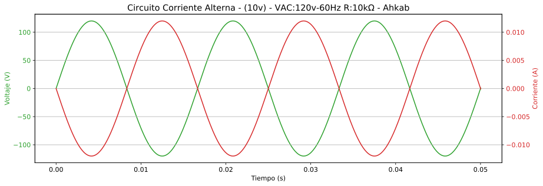

